# Travel & Notes - User Guide

- [Why Travel & Notes](#WhyTravelNotes)
- [Some explanations on the terms used](#SomeExplanations)
- [Before you start using Travel & Notes](#BeforeStart)
	- [How to introduce your access keys in Travel & Notes](#APIKeys)
- [Interface](#Interface1)
	- [Toolbar buttons on top of the interface](#InterfaceToolbar)
	- [Travel routes](#RoutesTravel)
		- [Toolbar buttons "Travel routes](#RouteToolbar)
	- [Route waypoints](#RouteWayPoints)
		- [Toolbar buttons "Waypoints of the route"](#WayPointsToolbar)
	- [Itinerary and notes](#ItineraryAndNotes)
	- [Route modes and route providers toolbar](#RouterButtons)
- [Edit boxes](#EditBoxes)
- [Routes and waypoints](#routes)	
	- [Create a waypoint](#AddWayPoint)
	- [Adding a waypoint with Drag And Drop](#AddWayPointDragDrop)
	- [Modify a waypoint](#ModifyWayPoint)
	- [Delete a waypoint](#DeleteWayPoint)
	- [Choose a route mode and route provider](#ItineraryModeAndProvider)
	- [Calculation of the itinerary](#ComputingItinerary)
	- [Save or discard changes](#SaveOrDiscardRoute)
	- [Route profile](#RouteProfile)
	- [Itinerary by train](#TrainItinerary)
	- [Editing the properties of a route](#RouteDlg)
	- [Print route maps](#PrintRouteMaps)
- [Notes](#Notes1)
	- [Add a travel note](#NewTravelNote)
	- [Add a route note](#NewRouteNote)
	- [Consult a note](#ViewNote)
	- [Modify a note](#ModifyNote)
	- [Delete a note](#DeleteNote)
	- [Move the icon of a note](#MoveNote)
	- [Change the latitude and longitude of a note](#LatLngNote)
	- [Turn a route note into a travel note](#RouteToTravelNote)
	- [Turn a travel note into a route note](#TravelToRouteNote)
	- [The note dialog box](#NoteDlg)
		- [Predefined route notes "SVG icon from OSM"](#SvgNoteFromOsm)
		- [Some examples of notes](#NoteSamples)
- [Background map menu](#MapsMenu)
- [Roadbook](#Roadbook)
- [Prepare a travel and consult it from the internet](#PrepareTravel)
- [Viewer](#Viewer)

<a id="WhyTravelNotes"></a>
## __Why Travel & Notes__

I go from time to time on a bike travel for several weeks, sometimes in isolated areas. This kind 
of travel can not be improvised, even if there is always a part of unforeseen. I needed a tool to 
prepare my route from the map and to add notes.

Yes, I know, there are a lot of applications that can make a route from one point to another, but 
none really gives me satisfaction: I do not often look for the shortest route - sometimes it's even 
a circular route - and in general we're limited to a few hundred kilometers.

Finally, it is also important to be able to record what has been prepared because it is not done in a 
few minutes. You must also be able to print the result. In some isolated areas, there is not always 
a mobile network or the possibility of recharging a battery. A good old hard copy is often valuable.

<a id="SomeExplanations"></a>
## __Some explanations on the terms used__

A **route** connects two points. On the map, it is represented by a polyline.

An **itinerary** is the description of the various changes of direction needed to follow a route.

A **travel** consists of one or more routes. They do not have to touch each other at their ends.
There may also be more than two routes starting from the same point.

In a travel, some routes may be **chained** between them. In this case, the different chained routes 
will be considered as only one for the calculation of the distances. One and only one chain maybe 
created by travel, but it is not mandatory that all routes are included in the chain.

A **note** is a set of information that relates to a specific point on the map or on a route. A note 
consists of an icon, a tooltip, a free text, an address, a link and a phone number. None of this 
information is required, except for the icon, which is used to represent the note on the map. 
This icon can be an image, a photo, a text ...

The **roadbook** is an HTML page that contains all the information of the travel: the notes, the 
routes and the itineraries.

<a id="BeforeStart"></a>
## __Before you start using Travel & Notes__

If you use Travel & Notes only to create notes, you can skip all the part about the access keys. 
These are only used for calculating routes and the display of certain maps.

Travel & Notes does not calculate routes and itineraries. It connects to a route provider to get 
this itinerary. The different route providers that can currently be used are GraphHopper, Mapbox, 
OpenRouteService and OSRM. It is also possible to draw a polyline between two places, without 
following paths. A train route between two stations can also be added, provided
that this route is encoded in OpenStreetMap, respecting the rules of public transport version 2.

For GraphHopper, OpenRouteService and Mapbox it is necessary to have an access key (**API Key**) 
to connect to the server. Check the websites of these different providers to obtain an access key.

You must also correctly read the conditions of use of the access keys and check that what you do 
with Travel & Notes corresponds to these conditions of use.

For the display of certain maps (Thunderforest, Lantmäteriet - Sweden, Mapbox), an access key
is also essential. For other maps, this is not necessary (OpenStreetMap,
aerial view ESRI, IGN - Belgium, Kartverket - Norway, Maanmittauslaitos - Finland).

You are also responsible for the use of your access keys. Remember that there may be billing that 
is done based on these access keys. Do not give them to anyone or do not let them hang around anywhere.

<a id="APIKeys"></a>
### How to introduce your access keys in Travel & Notes

Access keys are managed from the access keys dialog. To view it, click the :key: button 
in the toolbar at the top of the interface.

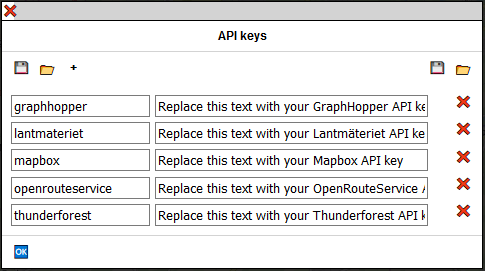

For each service provider, you must indicate on the left the name of this service provider and on the right
the access key. The name must correspond to the "providerName" encoded in the TravelNotesLayers.json file
(insensitive to upper / lower case).

Use the + button to add a service provider and the :x: button on the right to delete this one.

When your access keys are entered, press the button :ok: to finish.
Your keys are saved in the "sessionStorage" of the browser and available until closing
of it.

It is possible to save the access keys in a file, protected by a password or unprotected.

**Attention:**
- The page must be served in HTTPS to save in a file protected by a password.
- MS Edge (old versions) does not allow saving to a password protected file.

The button :arrows_counterclockwise: reloads the APIkeys file from the web server.

The button :floppy_disk: on the **left** of the dialog box allows you to save the access keys
in a password protected file. This must contain at least 12 characters including at least 
one uppercase, one lowercase, one number, and one other character.

The button :file_folder: on the **left** of the dialog box replaces all the access keys of the
dialog box with the contents of a password protected file.

These two buttons are only present if all the conditions to be able to save / restore the
keys with a password are met.

The button :floppy_disk: on the **right** of the dialog box allows you to save the access keys in
a file **not protected** by password.

The button :file_folder: on the **right** of the dialog box replaces all the access keys of the
dialog box by the contents of a file **not protected** by password.

If a password protected file named **APIKeys** is placed in the same directory as
Travel & Notes on the server, Travel & Notes will ask you for the password when you open it 
in order to use the keys contained in this file.

For geeks and paranos also see in the [installation guide](InstallationGuideEN.md#TravelNotesConfigJson) and in the file TravelNotesConfig.json:
- APIKeys.showDialogButton to show or hide the :key: button in the toolbar
- APIKeys.saveToSessionStorage to save or not the keys in the sessionStorage
- APIKeys.showAPIKeysInDialog to show or hide the keys as a password in the dialog box
- APIKeys.dialogHaveUnsecureButtons to show or hide the buttons :floppy_disk: and :file_folder: on __right__

The old method of entering access keys via the url continues to work:
- at the end of the url of the web page loading Travel & Notes: you need to enter a ? followed 
by the provider name + 'ProviderKey' followed by = followed by your access key. Several access keys 
can be introduced simultaneously by separating them by a &.

Sample:
```
https://www.example.org/TravelNotes/?MapboxProviderKey=your_Mapbox_access_key&GraphHopperProviderKey=your_GraphHopper_access_key
```

As soon as Travel & Notes detects access keys in the url, they are stored in the __sessionStorage__ and 
deleted from the url. They are no longer visible on the screen. **However, remember that a malicious 
person can always find them in the browser history**, unless you use the private mode of your browser.

<a id="Interface1"></a>
## __Interface__

When the map is displayed, only a small black rectangle is visible in the upper right corner of the map:


Move the mouse over this rectangle to see the complete interface:

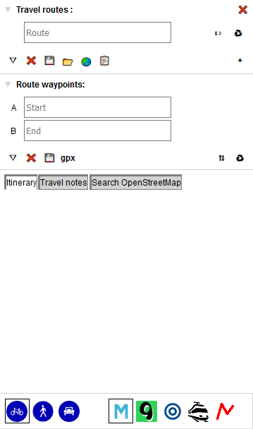

<a id="InterfaceToolbar"></a>
### Toolbar buttons on top of the interface

At the top of the interface is a first toolbar:
- the button :house: redirects to your home page
- the button ? redirects to
[the Travel & Notes help page on Github](https://github.com/wwwouaiebe/leaflet.TravelNotes/tree/gh-pages/TravelNotesGuides)
- the @ button redirects to a contact page. By default it is
[the Travel & Notes issues page on Github](https://github.com/wwwouaiebe/leaflet.TravelNotes/issues).
the url can be modified via the TravelNotes Config.json file (travelNotesToolbarUI.contactMail)
- the button :key: displays the dialog box of the access keys
- the button :globe_with_meridians: enables or disables localization.
- the button :pushpin: permanently displays the interface.

<a id="RoutesTravel"></a>
### Travel routes

In this part, the different travel routes as well as a toolbar are displayed.

For each route :
- the &#x21e7; and &#x21e9; buttons allow to change the order of the different routes. These buttons are 
visible only when multiple routes are present.
- The &#x21f0; button starts editing a route.
- The :recycle: button delete the route.

It is also possible to drag and drop to reorder the different routes.

When a route is chained, an icon &#x26d3; is present on the left.

It is possible to give a name to each route. This is not essential but can make your job easier, 
especially when the travel has a lot of routes.

<a id="RouteToolbar"></a>
#### Toolbar buttons "Travel routes"

- the button &#x25bd; enlarge the list of routes
- the button :x: erases all travel data and starts editing a new travel.
- the button :floppy_disk: saves the travel being edited to a file on your computer
- the button :file_folder: opens a previously saved travel
- the button :earth_asia: opens a previously saved travel and includes all routes and notes from that 
travel in the current edited travel
- the button :clipboard: opens the roadbook
- the button + add a new route to the travel

<a id="RouteWayPoints"></a>
### Route waypoints

Before you can view the waypoints of a route, it is necessary to start editing it with the &#x21f0; 
present in the route list.

Note that when Travel & Notes is launched, the first trip is directly edited. The same applies 
when a new route is created and the route being edited has not yet been modified.

<a id="WayPointsToolbar"></a>
#### Toolbar buttons "Waypoints of the route"

- the button &#x25bd; enlarge the list of waypoints
- the button :x: abandons the editing of the route. All changes will be lost and the route 
restored to the state it was in before being edited
- the button :floppy_disk: save the modifications made to the route.
- the button __gpx__ saves the route in a gpx file
- the button &#x21c5; reverse the order of waypoints
- the button :recycle: delete all waypoints

<a id="ItineraryAndNotes"></a>
### Itinerary and notes

This part includes the itinerary of the route as well as notes related to the route.

When the mouse is placed on a line of the itinerary, a marker is displayed at this location on the map.

A left click on a line of the itinerary will zoom in on the location on the map.

Right-clicking on an itinerary line will start editing a new route-related note, pre-filled 
with change of direction instructions

<a id="RouterButtons"></a>
### Route modes and route providers toolbar

The different route modes (bicycle, pedestrian, car, train or line) as well as the different 
route providers are selected on this toolbar.

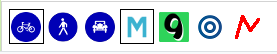

The blue buttons on the left allow you to select the route mode, the other buttons select 
the route providers.

Only the buttons that can be used are visible in the toolbar:
- the route modes depend on the route provider selected
- a route provider is only present if the corresponding plugin is installed and if the access key 
for this provider is known (when an access key is required).

<a id="EditBoxes"></a>
## Edit boxes

Sometimes an edit box may hide an object from the map you want to view. It is always possible to drag 
and drop an edit box by clicking on the bar at the top.

<a id="Routes"></a>
## Routes and waypoints

To add, modify or delete waypoints, it is necessary to edit the route from the interface or via the 
contextual menu of the route if it already exists.

All other modifications (notes, properties or name of the route) can be made, whether the route
is edited or not.

<a id="AddWayPoint"></a>
### Create a waypoint

To create a waypoint, right-click on the map at the desired location and choose "Select this point 
as start point", "Select this point as waypoint" or "Select this point as end point" in the menu:

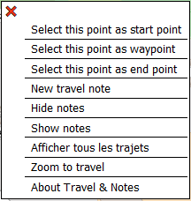

A green icon (for the start point), orange (for a waypoint) or red (for the end point) is added to 
the map at the chosen location and the waypoint is completed, either with the coordinates of the place, 
or with the address.

An intermediate waypoint added via the context menu will always be added at the end of the
list of intermediate waypoints. 

The order of the waypoints is also indicated (A for the start point, B for the ending point and a number
for the waypoints).

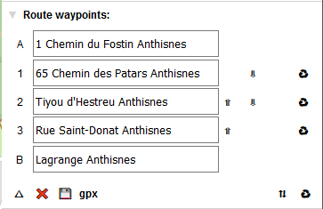

- the buttons &#x21e7; et &#x21e9; allow you to change the order of the intermediate points. These 
buttons are visible only when several intermediate points are present. It is not possible to transform 
the start point or end point into an intermediate point.
- the button :recycle: delete the waypoint. It is not possible to delete the start point or the end point.

<a id="AddWayPointDragDrop"></a>
### Adding a waypoint with Drag And Drop

Move the mouse over the route to see a temporary gray waypoint.
Then by dragging and dropping it, the waypoint is added to the path.

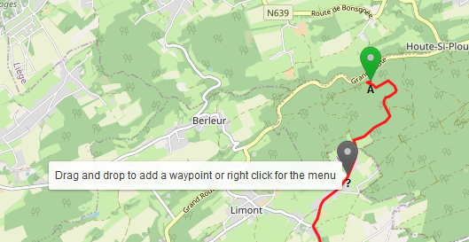

<a id="ModifyWayPoint"></a>
### Modify a waypoint

Drag and drop the waypoint on the map to change a waypoint

<a id="DeleteWayPoint"></a>
### Delete a waypoint

Right click on the waypoint and choose "delete this waypoint" from the menu. It is not possible to 
delete the start point or the end point. Only a drag and drop is possible.

<a id="ItineraryModeAndProvider"></a>
### Choose a route mode and route provider

Use the buttons at the bottom of the control to change the route mode (bike, pedestrian, car or train) 
as well as the route provider.


<a id="ComputingItinerary"></a>
### Calculation of the itinerary

When the starting point and end point are known, the route is calculated and displayed on the map. 
It's the same every time an intermediate point is added or a waypoint is moved.

The description of the route is also displayed in the "Itinerary and notes" section.

<a id="SaveOrDiscardRoute"></a>
### Save or discard changes

When editing a route is over, you must save it with the button :floppy_disk:.

It is also possible to abort editing a route and return to the situation before changes with 
the &#x274c; button. Warning, __all__ the changes will be lost, including modified properties 
and notes added since the beginning of editing.

Saving or discarding the modifications can also be done from the contextual menu of the journey.

<a id="RouteProfile"></a>
### Route profile

When a route is calculated with GraphHopper or OpenRouteService, it is possible to display a profile of this route.
Right-click on the __route__ and select "View the profile" from the context menu.

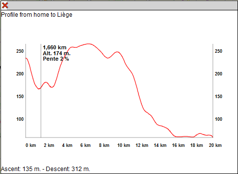

There may be multiple open windows displaying profiles.

It is possible to move a profile on the screen by dragging and dropping with the top bar of the window.

<a id="TrainItinerary"></a>
### Itinerary by train

Go to the [leaflet.TravelNotesPublicTransport documentation](https://github.com/wwwouaiebe/leaflet.TravelNotesPublicTransport/blob/master/README.md)
for more explanation on how to create a train route.

<a id="RouteDlg"></a>
### Editing the properties of a route

Right click on the route and select "Properties" from the context menu.

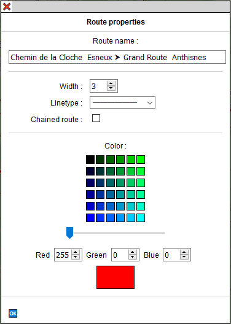

The first 6 rows of color buttons are used to select the color used to display the route. The last 
row of color buttons adds more or less shade of red in the proposed colors.

Each shade of red, green and blue for the desired color can also be individually set via the 3 
color editing areas.

It is also possible to change the width of the route as well as the type of line and also chaining 
the route.

<a id="PrintRouteMaps"></a>
### Print route maps

Please note: this command is experimental. It may not work with your Travel & Notes installation 
if you have added other elements to the page. In addition, not all browsers have implemented all 
the necessary css tags. If this command does not suit you, you can disable it from the 
TravelNotesConfig.json file (printRouteMap.isEnabled).
See the [installation guide](GuideInstallationFR.md#TravelNotesConfigJson).

Right-click on the route for which you want to print the maps and select "Print the maps for this route" 
from the context menu.

The edit box is displayed:

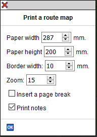

"Paper width" et "Paper height": this is the width and height of the printable area of the paper.
 You must check this with your printer.

"Border width": it is an area around the map and inside it which will be reprinted in the 
following map.

"Zoom" : the zoom to use for maps. It is independent of the zoom used to display the map before launching 
the command. For reasons of performance of the tile servers, it is not possible to use a zoom 
larger than 15.

"Insert a page break": when this box is checked, a page break is inserted after each map.

"Print notes" when this box is checked, the notes icon is printed on the map.

When the edit box is closed with the "ok" button, the map and controls are replaced by views of the map that 
have the desired dimensions and two buttons are present at the top right:


The button &#x1F5A8;&#xFE0F; will launch the print command from your browser and the button &#x274c; 
will cancel printing and redisplay the map.

When the print command of the browser is closed, the print views will also be closed and 
the map redisplayed.

All the default values of the edit box can be modified in the TravelNotesConfig.json file.
See the [installation guide](GuideInstallationFR.md#TravelNotesConfigJson).

Avoid overloading the tile servers. Issue this command only if you really need it.
Decreasing the paper size, the margin size and the zoom will also decrease the number of tiles required.

When the edit box is closed, the program calculates the number of tiles required. If this number is too 
large, the command is stopped.

#### Some tips for printing with a browser based on Chrome (Brave, Vivaldi, MS Edge latest version, Chromium, Chrome)

- Check the box "Insert a page break"
- indicate as "paper height" the actual height of your paper minus the top and bottom printing margins minus 1 mm
- for geeks: you can insert a css file in the html page with a css @page rule to fix the dimensions,
 orientation and margins of the paper:
```
@page {
  size: A4 landscape;
  margin: 7mm;
}
```

#### Some tips for printing with Firefox

- Never check the "Insert page break" box or use a css @page rule. If you do this, the route will not be 
printed correctly after the page break.
- indicate as "paper height" the actual height of your paper minus the top and bottom printing 
margins minus 1 mm (to be checked with your printer ...). Check that everything is correct with the
 "Print preview" command in Firefox.

<a id="Notes1"></a>
## __Notes__

There are two kinds of notes: travel notes and route notes. The position of the travel notes 
is completely free and they will all be displayed at the beginning of the roadbook. Route notes 
are always positioned on a route and displayed with the route in the roadbook.

<a id="NewTravelNote"></a>
### Add a travel note

Right-click at the desired point on the __map__ and select "New travel note" from the context menu.

<a id="NewRouteNote"></a>
### Add a route note

Right-click at the desired location on the __route__ and select "Add a note on the route" in 
the context menu.

<a id="ViewNote"></a>
### Consult a note

Left click on the note icon.

<a id="ModifyNote"></a>
### Modify a note

Right-click on the note icon and select "Edit this note" from the context menu.

<a id="DeleteNote"></a>
### Delete a note

Right-click on the note icon and select "Delete this note" from the context menu.

<a id="MoveNote"></a>
### Move the icon of a note

Drag and drop the note. A line will be drawn between the icon of the note and the point chosen for 
the insertion of the note. The latitude and longitude of the note are not modified.

<a id="LatLngNote"></a>
### Change the latitude and longitude of a note

Move the note icon to make the line visible. Then drag and drop the free end of this line.

A route note always has its latitude and longitude on the route. When the line is dropped, the nearest 
point on the route is searched and the free end of the line moved to this point.

<a id="RouteToTravelNote"></a>
### Turn a route note into a travel note

Right-click on the note icon and select "Transform to travel note" from the context menu. 
The transformation is only possible if no route is being edited.

<a id="TravelToRouteNote"></a>
### Turn a travel note into a route note

Right-click on the note icon and select "Transform to route note" from the context menu. 
The transformation is only possible if no route is being edited. The note will be attached 
to the route closest to it.

<a id="NoteDlg"></a>
### The note dialog box

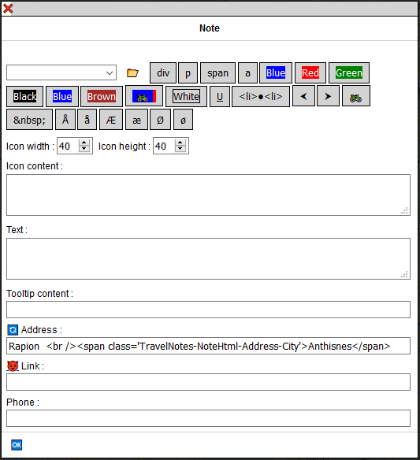

At the top of the box, a drop-down list allows you to choose predefined notes. It is possible to 
modify this list. See the [installation guide](InstallationGuideEN.md#TravelNotesNoteDialogJson).

The :file_folder: button allows you to load your own file with predefined notes in Travel & Notes. 
Consult the [installation guide](InstallationGuideEN.md#TravelNotesNoteDialogJson) to find out how create this file.

The div p span and a buttons add html tags &lt;div&gt;, &lt;p&gt;, &lt;span&gt; et &lt;a&gt; to 
edit boxes. All other buttons are editable and also allow you to insert predefined text into the 
edit boxes. See the [installation guide](InstallationGuideEN.md#TravelNotesNoteDialogJson).

Each edit box can contain plain text or html, except for the "Link" area.

The "Icon Content" area will be used to represent the note on the map and can not be empty 
(leaving this area blank would prevent any subsequent changes to the note).

The "Address" area is completed automatically when creating the note - 
[Nominatim](http://wiki.openstreetmap.org/wiki/Nominatim) is used to geotag the notes.
This area will never be changed by Nominatim afterwards, even if the note has been moved. 
The button &#x1f504; allows, however, to request a new geolocation to Nominatim.

<a id="SvgNoteFromOsm"></a>
#### Predefined route notes "SVG icon from OSM"

When creating a route note, you can choose "SVG icon from OSM" in the list of predefined notes. 
In this case, Travel & Notes will search OpenStreetMap the nearest intersection located on the 
route and will create an SVG icon showing the streets near this intersection.

The intersection will be placed in the center of the icon and its content will be oriented 
according to the path followed: the route by which one arrives at the intersection will be 
turned towards the bottom of the icon.

The address will also be modified: all the street names found at the intersection will be indicated, 
separated by a symbol &#x2AA5;. The first street name will always be the one by which we arrive at 
the intersection and the last name the one by which one leaves the intersection. 
This name will be preceded by an arrow indicating the direction to follow. The name of the 
town / city will also be added. If a hamlet or village name is found near the intersection, 
it will also be added in parentheses.

<a id="NoteSamples"></a>
#### Some examples of notes

##### A simple note created from a predefined note

The dialog box: 

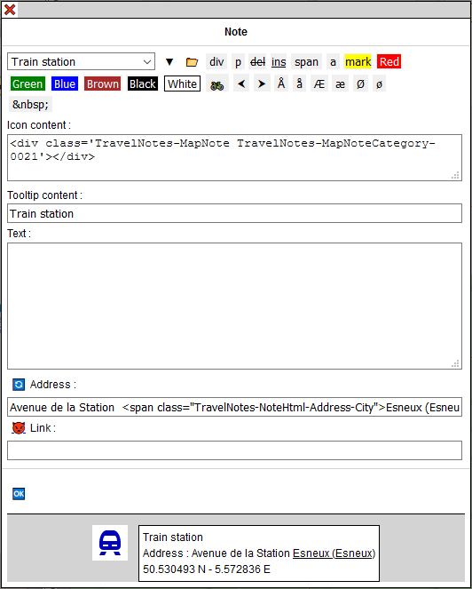

And the result on TravelNotes:

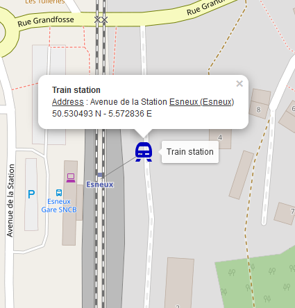

##### A route note created with "SVG icon from OSM"

The path goes from right to left. The intersection of Tiyou d'Hestreu, Chemin des Patars and Basse Voie
streets is at the center of the icon. The streets are oriented so that a person who follows the path on 
the ground sees the streets in the same position as on the icon. The street we arrive at is Tiyou 
d'Hestreu. An arrow to the right indicates that you must turn right in the Basse Voie. We are in the 
city of Anthisnes and the hamlet of Limont.

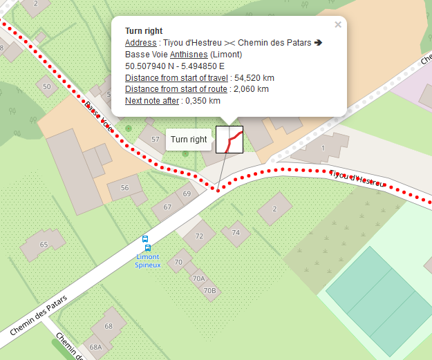

##### A note with a text on a line

The dialog box: 

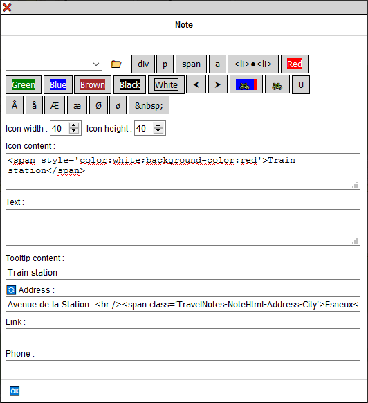

And the result on TravelNotes:

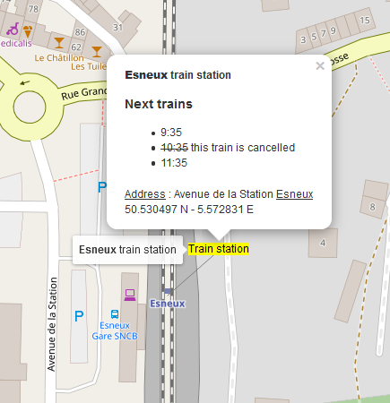

##### A note with a photo

The dialog box:


And the result on TravelNotes:

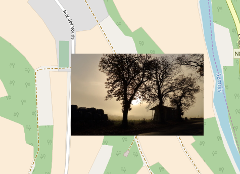

<a id="MapsMenu"></a>
## __Background map menu__

On the left of the screen, a toolbar allows you to choose different background maps. Only a little
black rectangle is visible on the screen:

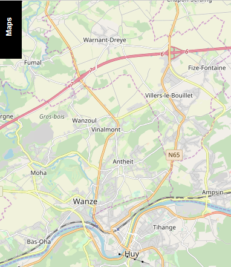

Move the mouse over this rectangle to display the entire toolbar:

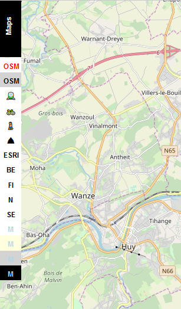

For each background map there is a button in the toolbar. 
The composition of the toolbar depends on the maps defined in the TravelNotesLayers.json file 
as well as the access keys that have been introduced. Consult the [installation guide](InstallationGuideEN.md#TravelNotesLayersJson).

It is possible to move around in the toolbar using the mouse wheel.

<a id="Roadbook"></a>
## __Roadbook__

Click on the button :clipboard:. A new tab is created with the roadbook. This contains all the routes as 
well as all the notes that have been created on the map. It is possible to choose what you want to see 
in the roadbook via the menu at the top of the page:

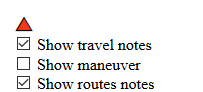

The "Save" button saves the html file on your PC. 

<a id="PrepareTravel"></a>
## __Prepare a travel and consult it from the internet__

It is possible to prepare a travel, save it in a file on a web server and consult it from the internet.

To consult the travel, you must call TravelNotes by giving it as a parameter in the URL the address 
of the file converted to base64.

```
https://wwwouaiebe.github.io/leaflet.TravelNotes/?fil=aHR0cHM6Ly93d3dvdWFpZWJlLmdpdGh1Yi5pby9zYW1wbGVzL0xpZWdlL1N0YXRpb25Ub1lvdXRoSG9zdGVsLnRydg==
```

aHR0cHM6Ly93d3dvdWFpZWJlLmdpdGh1Yi5pby9zYW1wbGVzL0xpZWdlL1N0YXRpb25Ub1lvdXRoSG9zdGVsLnRydg== 
is 
https://wwwouaiebe.github.io/samples/Liege/StationToYouthHostel.trv
base64 encoded

See the sample on the [demo](https://wwwouaiebe.github.io/leaflet.TravelNotes/?fil=aHR0cHM6Ly93d3dvdWFpZWJlLmdpdGh1Yi5pby9zYW1wbGVzL0xpZWdlL1N0YXRpb25Ub1lvdXRoSG9zdGVsLnRydg==&lng=en)

When such a file is displayed, it is not possible to modify it. The TravelNotes interface is not 
visible and all context menus are disabled.

<a id="Viewer"></a>
## __Viewer__

Some older browsers, especially on mobile phones, do not always understand all of the Travel & Notes 
JavaScript code. In this case, you can try a simplified version of Travel & Notes which just allows 
you to view the files. The url must be completed in the same way as for the normal version:

```
https://wwwouaiebe.github.io/leaflet.TravelNotes/viewer/?fil=aHR0cHM6Ly93d3dvdWFpZWJlLmdpdGh1Yi5pby9zYW1wbGVzL0xpZWdlL1N0YXRpb25Ub1lvdXRoSG9zdGVsLnRydg==
```

You can however add &lay at the end of the url to also display a toolbar showing the background maps 
not requiring an access key.

```
https://wwwouaiebe.github.io/leaflet.TravelNotes/viewer/?fil=aHR0cHM6Ly93d3dvdWFpZWJlLmdpdGh1Yi5pby9zYW1wbGVzL0xpZWdlL1N0YXRpb25Ub1lvdXRoSG9zdGVsLnRydg==&lay
```

See the sample on the
[demo](https://wwwouaiebe.github.io/leaflet.TravelNotes/viewer/?fil=aHR0cHM6Ly93d3dvdWFpZWJlLmdpdGh1Yi5pby9zYW1wbGVzL0xpZWdlL1N0YXRpb25Ub1lvdXRoSG9zdGVsLnRydg==&lay)

Other samples:

[An excerpt from my last bike trip from Dover to Chester](https://wwwouaiebe.github.io/leaflet.TravelNotes/viewer/?fil=aHR0cHM6Ly93d3dvdWFpZWJlLmdpdGh1Yi5pby9zYW1wbGVzL1VLMjAxOS9VSzIwMTkudHJ2) 

[The maps for the first route of Dover to Chester](https://wwwouaiebe.github.io/samples/UK2019/UK2019.pdf)

[A train, bus and bicycle trip from Liège to Tromsø](https://wwwouaiebe.github.io/leaflet.TravelNotes/viewer/?fil=aHR0cHM6Ly93d3dvdWFpZWJlLmdpdGh1Yi5pby9zYW1wbGVzL0xpZWdlLVRyb21zw7gvc3VvbWkyMDE4MDYwOC50cnY=)

[And the roadbook from Liège to Tromsø](https://wwwouaiebe.github.io/samples/Liege-Tromsø/suomi20180608-Roadbook.html)
