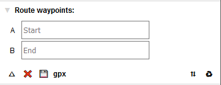
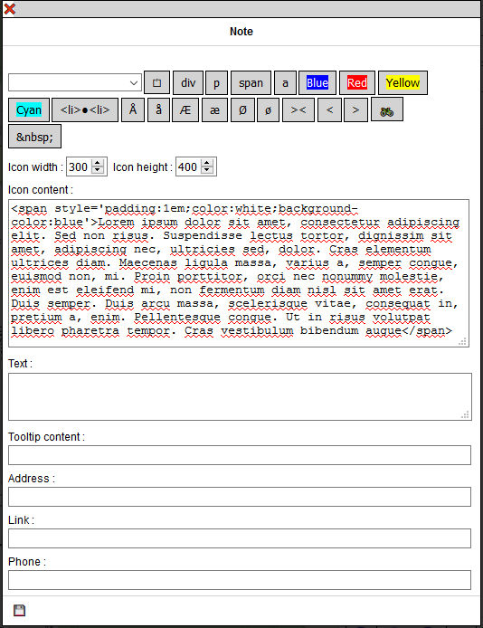

# Travel & Notes - User Guide

## __Why Travel & Notes__

I go from time to time on a bike travel for several weeks, sometimes in isolated areas. This kind of travel can not be improvised, even if there is
always a part of unforeseen. I needed a tool to prepare my route from the map and to add notes.

Yes, I know, there are a lot of applications that can make a route from one point to another, but none really gives me satisfaction:
I do not often look for the shortest route - sometimes it's even a circular route - and in general we're limited to a few hundred
kilometers.

Finally, it is also important to be able to record what has been prepared because it is not done in a few minutes. You must also be able to print the result.
In some isolated areas, there is not always a mobile network or the possibility of recharging a battery. A good old hard copy is often valuable.

## __Some explanations on the terms used__

A **route** connects two points. On the map, it is represented by a polyline.

An **itinerary** is the description of the various changes of direction needed to follow a route.

A **travel** consists of one or more routes. They do not have to touch each other at their ends. There may also be more than two routes
starting from the same point.
In a travel, some routes may be **chained** between them. In this case, the different chained routes will be considered as only one for the calculation of the distances. One and only one chain
maybe created by travel, but it is not mandatory that all routes are included in the chain.

A **note** is a set of information that relates to a specific point on the map or on a route. A note consists of an icon, a tooltip, a free text, an address, a link and a phone number.
None of this information is required, except for the icon, which is used to represent the note on the map. This icon can be an image, a photo, a text ...

The **roadbook** is an HTML page that contains all the information of the travel: the notes, the routes and the itineraries.

## __Before you start using Travel & Notes__

If you use Travel & Notes only to create notes, you can skip all the part about the access keys. These are only used for calculating routes.

Travel & Notes does not calculate routes and itineraries. It connects to a route provider to get this route. The different route providers that can currently be used
are GraphHopper, Mapbox and OSRM. It is also possible to draw a polyline between two places, without following paths.

For GraphHopper and Mapbox it is necessary to have an access key (**API Key**) to connect to the server. Check the websites of these different providers to obtain an access key.

You must also correctly read the conditions of use of the access keys and check that what you do with Travel & Notes corresponds to these conditions of use.

You are also responsible for the use of your access keys. Remember that there may be billing that is done based on these access keys. Do not give them to anyone
or do not let them hang around anywhere.

### How to introduce your access keys in Travel & Notes

The only way to introduce access keys in Travel & Notes is to put them at the end of the url of the web page loading Travel & Notes: you need to enter a ? followed by the provider name + ProviderKey 
followed by = followed by your access key. Several access keys can be introduced simultaneously by separating them by a &.

Sample:
```
https://www.example.org/TravelNotes/?MapboxProviderKey=votre_clef_accessMapbox&GraphHopperProviderKey=votre_clef_acces_GraphHopper
```

The access keys are saved in the __sessionStorage__ of the browser. It is therefore not necessary to reintroduce them each time the page is refreshed. However, they are permanently erased
when closing the browser.

As soon as Travel & Notes detects access keys in the url, they are stored in the __sessionStorage__ and deleted from the url. They are no longer visible on the screen.
**However, remember that a malicious person can always find them in the browser history**, unless you use the private mode of your browser.

## __Interface__

When the map is displayed, only a small black rectangle is visible in the upper right corner of the map:


Move the mouse over this rectangle to see the complete interface:


If you want the interface to always be visible, click on the button &#x1f4cc;

### Travel routes

In this part, the different travel routes as well as a toolbar are displayed.

For each route :
- the &#x21e7; and &#x21e9; buttons allow to change the order of the different routes. These buttons are visible only when multiple routes are present.
- The &#x21f0; starts editing a route.
- The &#x267b; delete the route.

It is also possible to drag and drop to reorder the different routes.

When a route is chained, an icon &#x26d3; is present.

It is possible to give a name to each route. This is not essential but can make your job easier, especially when the travel has a lot of routes.

#### Toolbar buttons "Travel routes"

- the button &#x25bd; enlarge the list of routes
- the button &#x274c; erases all travel data and starts editing a new travel.
- the button &#x1f4be; saves the travel being edited to a file on your computer
- the button &#x1f4c2; opens a previously saved travel
- the button &#x1F30F; opens a previously saved travel and includes all routes and notes from that travel in the current edited travel
- the button &#x1f4cb; opens the roadbook
- the button + add a new route to the travel

### Route waypoints

Before you can view the waypoints of a route, it is necessary to start editing it with the &#x21f0; present in the route list.



#### Toolbar buttons "Waypoints of the route"

- the button &#x25bd; enlarge the list of waypoints
- the button &#x274c; abandons the editing of the route. All changes will be lost and the route restored to the state it was in
before being edited
- the button &#x1f4be; save the modifications made to the route.
- the button __gpx__ saves the route in a gpx file
- the button &#x21c5; reverse the order of waypoints
- the button &#x267b; delete all waypoints

#### Create a waypoint

To create a waypoint, right-click on the map at the desired location and choose "Select this point as start point", "Select this point as waypoint"
or "Select this point as end point" in the menu:


A green icon (for the start point), orange (for a waypoint) or red (for the end point) is added to the map at the chosen location and the waypoint is completed,
either with the coordinates of the place, or with the address.

The order of the waypoints is also indicated (A for the start point, B for the ending point and a number for the waypoints).


- the buttons &#x21e7; et &#x21e9; allow you to change the order of the intermediate points. These buttons are visible only when several intermediate points are present.
It is not possible to transform the start point or end point into an intermediate point.
- the button &#x267b; delete the waypoint. It is not possible to delete the start point or the end point.

#### Modify a waypoint

Drag and drop the waypoint on the map to change a waypoint

#### Delete a waypoint

Right click on the waypoint and choose "delete this waypoint" from the menu. It is not possible to delete the start point or the end point. Only a drag and drop is possible.

#### Choose a route mode and route provider

Use the buttons at the bottom of the control to change the route mode (bike, pedestrian or car) as well as the route provider.


#### Calculation of the itinerary

When the starting point and end point are known, the route is calculated and displayed on the map. It's the same every time
an intermediate point is added or a waypoint is moved.

The description of the route is also displayed in the "Itinerary and notes" section.

#### Insert an intermediate point.

When an intermediate point is added via the map context menu, it is always added as the last intermediate point. This can give strange results
on the calculated route.

To avoid this, it is also possible to add a waypoint at a specific point in the route. Right click on the __route__ where you want to insert
the waypoint and select in the context menu "Add a waypoint on the route". The new point can then be moved to its new position
with a drag and drop.

#### Save or discard changes

When editing a route is over, you must save it.

It is also possible to abort editing a route and return to the situation before changes with the &#x274c; button. Warning, __all__ the changes will be
lost, including modified properties and notes added since the beginning of editing.

### Itinerary and notes

This part includes the itinerary of the route as well as notes related to the route.

When the mouse is placed on a line of the itinerary, a marker is displayed at this location on the map.

A left click on a line of the itinerary will zoom in on the location on the map.

Right-clicking on an itinerary line will start editing a new route-related note, pre-filled with change of direction instructions

## __Notes__

There are two kinds of notes: travel notes and route notes. The position of the travel notes is completely free and they will all be displayed at the beginning of the roadbook.
Route notes are always positioned on a route and displayed with the route in the roadbook.

### Add a travel note

Right-click at the desired point on the __map__ and select "New travel note" from the context menu.

### add a route note

Right-click at the desired location on the __route__ and select "Add a note on the route" in the context menu.

### Consult a note

Left click on the note icon.

### Modify a note

Right-click on the note icon and select "Edit this note" from the context menu.

### Delete a note

Right-click on the note icon and select "Delete this note" from the context menu.

### Move the icon of a note

Drag and drop the note. A line will be drawn between the icon of the note and the point chosen for the insertion of the note. The latitude and longitude of the note
are not modified.

### Change the latitude and longitude of a note

Move the note icon to make the line visible. Then drag and drop the free end of this line.

A route note always has its latitude and longitude on the route. When the line is dropped, the nearest point on the route is searched and the free end
of the line moved to this point.

### The note dialog box


At the top of the box, a drop-down list allows you to choose predefined notes. It is possible to modify this list. See the installation guide.

The first button allows you to load your own file with predefined notes in Travel & Notes. Consult the installation guide to find out how
create this file.

The div p span and a buttons add html tags &lt;div&gt;, &lt;p&gt;, &lt;span&gt; et &lt;a&gt; to edit boxes. All other buttons are editable and
also allow you to insert predefined text into the edit boxes. See the installation guide.

Each edit box can contain plain text or html, except for the "Link" area.

The "Icon Content" area will be used to represent the note on the map and can not be empty (leaving this area blank would prevent any subsequent changes to the note).

The "Address" area is completed automatically when creating the note - [Nominatim](http://wiki.openstreetmap.org/wiki/Nominatim) is used to geotag the notes.
This area will never be changed by Nominatim afterwards, even if the note has been moved.

#### Some examples of notes

##### A simple note created from a predefined note

The dialog box: 


And the result on TravelNotes:


##### A note with a text on a line

The dialog box: 


And the result on TravelNotes:


##### A note with a text on several lines

The dialog box: 



And the result on TravelNotes:


##### A note with a photo

The dialog box:


And the result on TravelNotes:


### Editing the properties of a route

Right click on the route and select "Properties" from the context menu.


The first 6 rows of color buttons are used to select the color used to display the route. The last row of color buttons adds more or less
shade of red in the proposed colors.

Each shade of red, green and blue for the desired color can also be individually set via the 3 color editing areas.

It is also possible to change the width of the route as well as the type of line and also chaining the route.

### Move an edit box on the screen.

Sometimes an edit box may hide an object from the map you want to view. It is always possible to drag and drop an edit box by clicking on the bar at the top.

## __Roadbook__

Click on the button &#x1f4cb;. A new tab is created with the roadbook. This contains all the routes as well as all the notes that have been
created on the map. It is possible to choose what you want to see in the roadbook via the menu at the top of the page:


## Prepare a travel and consult it from the internet

It is possible to prepare a travel, save it in a file on a web server and consult it from the internet.

To consult the travel, you must call TravelNotes by giving it as a parameter in the URL the address of the file converted to base64.

```
https://wwwouaiebe.github.io/leaflet.TravelNotes/?fil=aHR0cHM6Ly93d3dvdWFpZWJlLmdpdGh1Yi5pby9zYW1wbGUudHJ2
```

aHR0cHM6Ly93d3dvdWFpZWJlLmdpdGh1Yi5pby9zYW1wbGUudHJ2 is https://wwwouaiebe.github.io/sample.trv base64 encoded.

See the sample on the [demo](https://wwwouaiebe.github.io/leaflet.TravelNotes/?fil=aHR0cHM6Ly93d3dvdWFpZWJlLmdpdGh1Yi5pby9zYW1wbGUudHJ2&lng=en)

When such a file is displayed, it is not possible to modify it. The TravelNotes interface is not visible and all context menus are disabled.