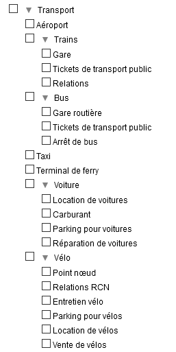
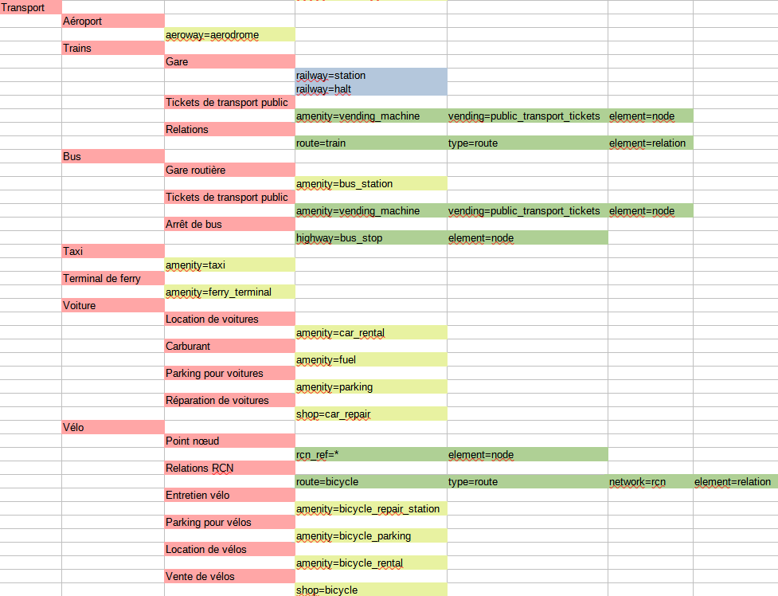

# Travel & Notes - Guide d'installation

- [Où installer Travel & Notes?](#WhereInstall)
- [Guide d'installation pour les null](#GuideNull)
- [Guide d'installation pour les geeks](#GuideGeeks)
	- [Que faut-il faire dans le fichier HTML?](#HtmlPage)
	- [Quelques explications complémentaires sur le Javascript](#MoreOnJS)
	- [Le contenu du fichier TravelNotesConfig.json](#TravelNotesConfigJson)
	- [Le contenu du fichier TravelNotesLayers.json](#TravelNotesLayersJson)
	- [Le contenu des fichiers TravelNotesNoteDialogFR.json et TravelNotesNoteDialogEN.json](#TravelNotesNoteDialogJson)
	- [Le contenu du fichier de configuration pouvant être chargé avec le bouton 📂 dans la boite d'édition des notes](#myTravelNotesNoteDialogJson)
	- [Configurer "Rechercher dans OpenStreetMap"](#OsmSearch)
- [Utiliser le viewer](#Viewer)
- [Traductions](#Translations)
- [Plugins](#Plugins)

<a id="WhereInstall"></a>
## Où installer Travel & Notes?

Pour des raisons de sécurité, il n'est plus possible d'utiliser Travel & Notes depuis le disque d'un 
ordinateur. Il est indispensable de passer par l'intermédiaire soit d'un serveur web distant, soit
d'un serveur web local de type LAMP or MAMP.
Voir https://www.mozilla.org/en-US/security/advisories/mfsa2019-21/#CVE-2019-11730

<a id="GuideNull"></a>
## Guide d'installation pour les null

Pas de grandes connaissances informatiques? Si la démo vous convient, vous pouvez télécharger celle-ci 
en vous rendant dans la branche gh-pages.
Encore trop compliqué? suivez directement ce 
[lien](https://github.com/wwwouaiebe/leaflet.TravelNotes/archive/gh-pages.zip)
 qui vous permet de télécharger la démo. Ouvrez le fichier zip et installez son contenu dans 
 un répertoire sur votre serveur et ouvrez le fichier index.html. That's all :-).

<a id="GuideGeeks"></a>
## Guide d'installation pour les geeks

<a id="HtmlPage"></a>
### Que faut-il faire dans le fichier HTML?

Travel & Notes utilise [Leaflet](http://leafletjs.com/) pour afficher la carte. Vous devez donc 
télécharger et installer Leaflet.

Dans le &lt;head&gt; du fichier, chargez la feuille de style de Leaflet et de TravelNotes

```
<head>
	...
	<link rel="stylesheet" href="leaflet/leaflet.css" />
	<link rel="stylesheet" href="TravelNotes.min.css" />
	...
</head>
```

Et dans le &lt;body&gt; chargez les Javascript de Leaflet, de TravelNotes et des plugins de TravelNotes

```
<body>
	...
	<script src="leaflet/leaflet.js"></script>
	<noscript>Oh oh. Javascript is not enabled. It's impossible to display this page without javascript.</noscript>
	<script src="TravelNotes.min.js"></script>
	<!-- 
		Route providers scripts for Mapbox, Stadia Maps (MapzenValhalla), GraphHopper and OpenRouteService have only to be installed 
		if you have an API key for Mapbox, Stadia Maps, GraphHopper or openRouteService.
		Route providers scripts for OSRM, public transport and polyline have only to be installed 
		if you will work with these providers.  -->
	<script src="TravelNotesProviders/MapboxRouteProvider.min.js"></script>
	<script src="TravelNotesProviders/MapzenValhallaRouteProvider.min.js"></script>
	<script src="TravelNotesProviders/GraphHopperRouteProvider.min.js"></script>
	<script src="TravelNotesProviders/OpenRouteServiceRouteProvider.min.js"></script>
	<script src="TravelNotesProviders/OSRMRouteProvider.min.js"></script>
	<script src="TravelNotesProviders/PublicTransportRouteProvider.min.js"></script>
	<script src="TravelNotesProviders/PolylineRouteProvider.min.js"></script>
</body>
```

Travel & Notes créera automatiquement la carte et tous les contrôles nécessaires.

<a id="MoreOnJS"></a>
### Quelques explications complémentaires sur le Javascript

Voyez la [documentation du code JS](https://github.com/wwwouaiebe/leaflet.TravelNotes/blob/gh-pages/TechDoc/index.html )
pour plus d'informations.

Notez cependant que seul l'objet TravelNotes est accessible depuis du code JS additionnel 
(via window.TaN - window.L.TravelNotes est déprécié mais continue à fonctionner pour l'instant).

Si vous désirez utiliser d'autres objets, vous devez télécharger les sources et les importer dans votre code comme 
des modules EcmaScript.

<a id="TravelNotesConfigJson"></a>
### Le contenu du fichier TravelNotesConfig.json

Ce fichier permet de modifier certains comportements de TravelNotes. Soyez prudent quand vous 
modifiez ce fichier. Vous devez suivre __toutes__ les règles d'écriture des fichiers json.

Le contenu du fichier TravelNotesConfig.json:
- __APIKeys.saveToSessionStorage__ : quand cette valeur est true, les clefs d'accès sont sauvées dans le 'sessionStorage' ( valeur par défaut : true )
- __APIKeysDialog.haveUnsecureButtons__ : quand cette valeur est true, des  boutons pour enrégistrer ou restaurer les clefs d'accès dans un fichier non sécurisé sont présents ( valeur par défaut : false )
- __APIKeysDialog.showAPIKeys__ : quand cette valeur est true, les clefs d'accès sont lisibles dans la boite de dialogue ( valeur par défaut : false )
- __APIKeysDialog.showButton__ : quand cette valeur est true, le bouton 🔑 est présent dans la barre d'outils ( valeur par défaut : true )
- __colorDialog.haveSlider__ : quand cette valeur est true, le dialogue des propriétés des routes a un slider pour la couleur rouge, autrement il a des boutons ( valeur par défaut : true )
- __colorDialog.initialRed__ : la valeur initiale pour le slider rouge ( valeur par défaut : 0 )
- __contextMenu.timeout__ : le temps qui va s'écouler, en millisecondes, entre le moment où la souris ne se trouve plus sur le menu contextuel et le moment ou le menu se ferme automatiquement ( valeur par défaut : 1500 )
- __errorsUI.helpTimeOut__ : le temps qui va s'écouler, en millisecondes, entre le moment où un message d'aide est affiché et le moment où il est effacé ( valeur par défaut : 30000 )
- __errorsUI.showError__ : quand cette valeur est true, les messages d'erreur sont affichés ( valeur par défaut : true )
- __errorsUI.showHelp__ : quand cette valeur est true, les messages d'aide sont affichés ( valeur par défaut : false )
- __errorsUI.showInfo__ : quand cette valeur est true, les messages d'information sont affichés ( valeur par défaut : true )
- __errorsUI.showWarning__ : quand cette valeur est true, les messages d'avertissement sont affichés ( valeur par défaut : true )
- __errorsUI.timeOut__ : le temps qui va s'écouler, en millisecondes, entre le moment où un message est affiché et le moment où il est effacé ( valeur par défaut : 10000 )
- __geoCoder.distances.city__ : la distance maximum en mètres entre le point donné par l'utilisateur pour une adresse et un point avec le tag place=city dans OSM, pour que ce tag soit utilisé dans l'adresse ( valeur par défaut : 1200 )
- __geoCoder.distances.hamlet__ : la distance maximum en mètres entre le point donné par l'utilisateur pour une adresse et un point avec le tag place=hamlet dans OSM, pour que ce tag soit utilisé dans l'adresse ( valeur par défaut : 200 )
- __geoCoder.distances.town__ : la distance maximum en mètres entre le point donné par l'utilisateur pour une adresse et un point avec le tag place=town dans OSM, pour que ce tag soit utilisé dans l'adresse ( valeur par défaut : 1500 )
- __geoCoder.distances.village__ : la distance maximum en mètres entre le point donné par l'utilisateur pour une adresse et un point avec le tag place=village dans OSM, pour que ce tag soit utilisé dans l'adresse ( valeur par défaut : 400 )
- __geoCoder.osmCityAdminLevel.DEFAULT__ : la valeur utilisée dans le tag OSM admin_level pour une municipalité ( valeur par défaut : 8 )
- __geoCoder.osmCityAdminLevel.GB__ : la valeur utilisée dans le tag OSM admin_level pour une municipalité dans un pays qui ne suit pas la règle par défaut de OSM. GB doit être remplacé par le code ISO 3166-1 du pays en question.
- __geoLocation.marker.color__ : la couleur du cercle utilisé pour indiquer la geolocalisation ( valeur par défaut : #ff0000 )
- __geoLocation.marker.radius__ : le rayon du cercle utilisé pour indiquer la geolocalisation ( valeur par défaut : 10 )
- __geoLocation.options.enableHighAccuracy__ : voir les options Javascript des fonctions de localisation ( valeur par défaut : false )
- __geoLocation.options.maximumAge__ : voir les options Javascript des fonctions de localisation ( valeur par défaut : 0 )
- __geoLocation.options.timeout__ : voir les options Javascript des fonctions de localisation ( valeur par défaut : 3600000 )
- __geoLocation.zoomFactor__ : le facteur de zoom utilisé pour la geolocalisation ( valeur par défaut : 17 )
- __geoLocation.zoomToPosition__ : quand cette valeur est true, un zoom sur la position sera effectué lors de la première geolocalisation ( valeur par défaut : true )
- __itineraryPaneUI.showManeuvers__ : quand cette valeur est true, les manoeuvres sont visibles dans la description de l'itinéraire ( valeur par défaut : false )
- __itineraryPaneUI.showNotes__ : quand cette valeur est true, les notes sont visibles dans la description de l'itinéraire ( valeur par défaut : true )
- __itineraryPoint.marker.color__ : la couleur du cercle utilisé pour indiquer sur la carte un point de l'itinéraire ( valeur par défaut : #ff0000 )
- __itineraryPoint.marker.fill__ : le remplissage du cercle utilisé pour indiquer sur la carte un point de l'itinéraire ( valeur par défaut : false )
- __itineraryPoint.marker.radius__ : le rayon du cercle utilisé pour indiquer sur la carte un point de l'itinéraire ( valeur par défaut : 7 )
- __itineraryPoint.marker.weight__ : l'épaisseur du cercle utilisé pour indiquer sur la carte un point de l'itinéraire ( valeur par défaut : 2 )
- __itineraryPoint.zoomFactor__ : le facteur de zoom utilisé lorsqu'un zoom est fait sur un point de l'itinéraire ( valeur par défaut : 17 )
- __layersToolbarUI.haveLayersToolbarUI__ : quand cette valeur est true, la barre d'outils des fonds de carte est présente ( valeur par défaut : true )
- __layersToolbarUI.toolbarTimeOut__ : le temps qui va s'écouler, en millisecondes, entre le moment où la souris ne se trouve plus sur la barre d'outils et le moment où cette barre d'outils se ferme automatiquement ( valeur par défaut : 1500 )
- __layersToolbarUI.theDevil.addButton__ : quand cette valeur est true, un bouton "theDevil" est ajouté à la barre d'outils ( valeur par défaut : true )
- __map.center.lat__ : la latitude utilisée pour le centre de la carte au démarage ( valeur par défaut : 50.50923 )
- __map.center.lng__ : la longitude utilisée pour le centre de la carte au démarage ( valeur par défaut : 5.49542 )
- __map.zoom__ : le zoom utilisé pour la carte au démarage ( valeur par défaut : 12 )
- __mouseUI.haveMouseUI__ : quand cette valeur est true, un contrôle est affiché en haut de l'écran, indiquant les coordonnées de la souris, la valeur du zoom ainsi que le statut de la sauvegarde ( valeur par défaut : true )
- __nominatim.url__ : l'url à utiliser pour Nominatim ( valeur par défaut : "https://nominatim.openstreetmap.org/" )
- __nominatim.language__ : la langue à utiliser pour Nominatim ( valeur par défaut : * )
- __note.grip.size__ : la dimension de la poignée à l'extrémité de la ligne de rappel d'une note ( valeur par défaut : 10 )
- __note.grip.opacity__ : l'opacité de la poignée à l'extrémité de la ligne de rappel d'une note - rappel : 0 = invisible ( valeur par défaut : 0 )
- __note.grip.moveOpacity__ : l'opacité de la poignée à l'extrémité de la ligne de rappel d'une note quand la souris se trouve sur la poignée ( valeur par défaut : 1 )
- __note.haveBackground__ : quand cette valeur est true, un arrière-plan blanc est affiché avec la note ( valeur par défaut : false )
- __note.maxManeuversNotes__ : le maximum de notes qui peuvent être créées avec la commande "Créer une note pour chaque maneoeuvre du trajet" ( valeur par défaut : 100 )
- __note.polyline.color__ : la couleur de la ligne de rappel d'une note ( valeur par défaut : #808080 )
- __note.polyline.weight__ : l'épaisseur de la ligne de rappel d'une note ( valeur par défaut : 1 )
- __note.reverseGeocoding__ : quand cette valeur est true, les coordonnées des notes sont remplacées par une adresse ( valeur par défaut : true )
- __note.svgIcon.angleDistance__ : la distance minimale à utiliser entre le centre de l'icône SVG et le point de l'itinéraire utilisé pour calculer la rotation de l'icône ( valeur par défaut : 10 )
- __note.svgIcon.angleDirection.right__ : l'angle maximum de la direction à suivre pour l'indication "Tourner à droite" dans le tooltip des icones SVG ( valeur par défaut : 35 )
- __note.svgIcon.angleDirection.slightRight__ : l'angle maximum de la direction à suivre pour l'indication "Tourner légèrement à droite" dans le tooltip des icones SVG ( valeur par défaut : 80 )
- __note.svgIcon.angleDirection.continue__ : l'angle maximum de la direction à suivre pour l'indication "Continuer" dans le tooltip des icones SVG ( valeur par défaut : 100 )
- __note.svgIcon.angleDirection.slightLeft__ : l'angle maximum de la direction à suivre pour l'indication "Tourner légèrement à gauche" dans le tooltip des icones SVG ( valeur par défaut : 145 )
- __note.svgIcon.angleDirection.left__ : l'angle maximum de la direction à suivre pour l'indication "Tourner à gauche" dans le tooltip des icones SVG ( valeur par défaut : 200 )
- __note.svgIcon.angleDirection.sharpLeft__ : l'angle maximum de la direction à suivre pour l'indication "Tourner fortement à gauche" dans le tooltip des icones SVG ( valeur par défaut : 270 )
- __note.svgIcon.angleDirection.sharpRight__ : l'angle maximum de la direction à suivre pour l'indication "Tourner fortement à droite" dans le tooltip des icones SVG ( valeur par défaut : 340 )
- __note.svgIcon.rcnRefDistance__ : la plus grande distance acceptable entre la note et le noeud OSM ayant une clef rcn_ref ( valeur par défaut : 20 )
- __note.svgIcon.roadbookFactor__ : le facteur d'agrandissement des icônes SVG dans le roadbook ( valeur par défaut : 6 )
- __note.svgIcon.zoom__ : la valeur du zoom utilisé pour réaliser les icônes SVG ( valeur par défaut : 17 )
- __noteDialog.areaHeight.icon__ : le nombre de lignes de la zone d'édition de l'icône ( valeur par défaut : 2 )
- __noteDialog.areaHeight.popupContent__ : le nombre de lignes de la zone d'édition du texte ( valeur par défaut : 8 )
- __noteDialog.mask.iconsDimension__ : quand cette valeur est true, les contrôles de dimension de l'icône sont masqués ( valeur par défaut : true )
- __noteDialog.mask.iconTextArea__ :  quand cette valeur est true, la zone d'édition de l'icône est masquée ( valeur par défaut : false )
- __noteDialog.mask.tooltip__ : quand cette valeur est true, la zone d'édition du tooltip est masquée ( valeur par défaut : false )
- __noteDialog.mask.popupContent__ : quand cette valeur est true, la zone d'édition du texte est masquée ( valeur par défaut : false )
- __noteDialog.mask.address__ : quand cette valeur est true, la zone d'édition de l'adresse est masquée ( valeur par défaut : false )
- __noteDialog.mask.link__ : quand cette valeur est true, la zone d'édition du lien est masquée ( valeur par défaut : false )
- __noteDialog.mask.phone__ : quand cette valeur est true, la zone d'édition du téléphone est masquée ( valeur par défaut : true )
- __noteDialog.theDevil.addButton__ : quand cette valeur est true, un bouton "theDevil" est ajouté à la boite de dialogue d'édition ( valeur par défaut : true )
- __noteDialog.theDevil.zoomFactor__ : le zoom utilisé pour le bouton "theDevil" ( valeur par défaut : 17 )
- __osmSearch.nextSearchLimit.color__ : la couleur de la polyline utilisée pour indiquer sur la carte la zone de la prochaine recherche ( valeur par défaut : "#ff0000" )
- __osmSearch.nextSearchLimit.fill__ : le remplissage de la polyline utilisée pour indiquer sur la carte la zone de la prochaine recherche ( valeur par défaut : false )
- __osmSearch.nextSearchLimit.weight__ : l'épaisseur de la polyline utilisée pour indiquer sur la carte la zone de la prochaine recherche ( valeur par défaut : 1 )
- __osmSearch.previousSearchLimit.color__ : la couleur de la polyline utilisée pour indiquer sur la carte la zone de la dernière recherche effectuée ( valeur par défaut : "#006400" )
- __osmSearch.previousSearchLimit.fill__ : le remplissage de la polyline utilisée pour indiquer sur la carte la zone de la dernière recherche effectuée ( valeur par défaut : false )
- __osmSearch.previousSearchLimit.weight__ : l'épaisseur de la polyline utilisée pour indiquer sur la carte la zone de la dernière recherche effectuée ( valeur par défaut : 1 )
- __osmSearch.searchPointMarker.color__ : la couleur du cercle utilisé pour indiquer sur la carte la position d'un résultat de recherche lorsque ce résultat est sous forme de point ( valeur par défaut : "#006400" )
- __osmSearch.searchPointMarker.fill__ : le remplissage du cercle utilisé pour indiquer sur la carte la position d'un résultat de recherche lorsque ce résultat est sous forme de point ( valeur par défaut : false )
- __osmSearch.searchPointMarker.radius__ : le rayon du cercle utilisé pour indiquer sur la carte la position d'un résultat de recherche lorsque ce résultat est sous forme de point ( valeur par défaut : 20 )
- __osmSearch.searchPointMarker.weight__ : l'épaisseur du cercle utilisé pour indiquer sur la carte la position d'un résultat de recherche lorsque ce résultat est sous forme de point ( valeur par défaut : 4 )
- __osmSearch.searchPointPolyline.color__ : la couleur de la polyline utilisée pour indiquer sur la carte la position d'un résultat de recherche lorsque ce résultat est sous forme de polyline ( valeur par défaut : "#006400" )
- __osmSearch.searchPointPolyline.fill__ : le remplissage de la polyline utilisée pour indiquer sur la carte la position d'un résultat de recherche lorsque ce résultat est sous forme de polyline ( valeur par défaut : false )
- __osmSearch.searchPointPolyline.weight__ : l'épaisseur de la polyline utilisée pour indiquer sur la carte la position d'un résultat de recherche lorsque ce résultat est sous forme de polyline ( valeur par défaut : 4 )
- __osmSearch.showSearchNoteDialog__ : quand cette valeur est true, la boite de dialogue d'édition des notes est affichée lorsqu'une note est créée à partir d'un résultat de recherche ( valeur par défaut : false )
- __overpassApi.timeOut__ : le temps qui va s'écouler, en secondes, entre le moment où une requête vers OverpassAPI est lancée et celui où un timeout sera déclenché ( valeur par défaut : 40 )
- __overpassApi.url__ : l'url à utiliser pour OverpassAPI ( valeur par défaut : "https://lz4.overpass-api.de/api/interpreter" )
- __printRouteMap.isEnabled__ : quand cette valeur est true, la commande pour imprimer les cartes d'un trajet est active ( valeur par défaut : true )
- __printRouteMap.borderWidth__ : la largeur en millimètres du bord de carte qui sera dupliqué dans chaque carte ( valeur par défaut : 10 )
- __printRouteMap.maxTiles__ : le maximum de tuiles pouvant être utilisées pour imprimer un trajet ( valeur par défaut : 720 )
- __printRouteMap.paperWidth__ : la largeur du papier en millimètres ( valeur par défaut : 287 )
- __printRouteMap.paperHeight__ : la hauteur du papier en millimètres ( valeur par défaut : 200 )
- __printRouteMap.pageBreak__ : quand cette valeur est true, un saut de page est inséré après chaque carte ( valeur par défaut : false )
- __printRouteMap.printNotes__ : quand cette valeur est true, l'icône des notes est également imprimée ( valeur par défaut : true ) 
- __printRouteMap.zoomFactor__ : le facteur de zoom à utiliser pour l'impression ( valeur par défaut : 15 )
- __printRouteMap.entryPointMarker.color__ : la couleur du marqueur de début de trajet sur chaque carte ( valeur par défaut : "#00ff00" )
- __printRouteMap.entryPointMarker.weight__ : l'épaisseur du marqueur de début de trajet sur chaque carte ( valeur par défaut : 4 )
- __printRouteMap.entryPointMarker.radius__ : le rayon du marqueur de début de trajet sur chaque carte ( valeur par défaut : 10 )
- __printRouteMap.entryPointMarker.fill__ : le remplissage du marqueur de début de trajet sur chaque carte ( valeur par défaut : true )
- __printRouteMap.entryPointMarker.fillOpacity__ : l'opacité du marqueur de début de trajet sur chaque carte ( valeur par défaut : 1 )
- __printRouteMap.exitPointMarker.color__ : la couleur du marqueur de fin de trajet sur chaque carte ( valeur par défaut : "#ff0000"
- __printRouteMap.exitPointMarker.weight__ : l'épaisseur du marqueur de fin de trajet sur chaque carte ( valeur par défaut : 4 )
- __printRouteMap.exitPointMarker.radius__ : le rayon du marqueur de fin de trajet sur chaque carte ( valeur par défaut : 10 )
- __printRouteMap.exitPointMarker.fill__ : le remplissage du marqueur de fin de trajet sur chaque carte ( valeur par défaut : true )
- __printRouteMap.exitPointMarker.fillOpacity__ : l'opacité du marqueur de fin de trajet sur chaque carte ( valeur par défaut : 1 )
- __route.color__ : la couleur par défaut d'un trajet ( valeur par défaut : "#ff0000" )
- __route.dashArray__ : le type de ligne à utiliser par défaut = un nombre correspondant à l'indice du type de ligne dans le tableau dashChoices ( valeur par défaut : 0 )
- __route.dashChoices__ : un tableau reprenant les différents type de lignes affichés dans la boite de dialogue RoutesPropertiesDialog. 
Text sera affiché dans le sélecteur du type de ligne et iDashArray est le template du type de ligne. 
Attention: les valeurs contenues dans ce tableau sont des valeurs numériques et seront multipliées par l'épaisseur de la ligne (width) et transformées en texte avant d'être utilisées pour adapter le type de ligne 
( valeur par défaut : "[ { text : "——————" , iDashArray :  [0] }, { text :  "—————", iDashArray : [ 4, 2 ] }, { text : "—‧—‧—‧—‧—" , iDashArray : [ 4, 2, 0, 2] }, { text : "················", iDashArray : [ 0,2 ] } ]" )
- __route.elev.smooth__ : quand cette valeur est true, le profil du trajet est lissé ( valeur par défaut : true )
- __route.elev.smoothCoefficient__ : un coefficient utilisé pour calculer la distance entre deux points pour le lissage de l'élévation ( valeur par défaut : 0.25 )
- __route.elev.smoothPoints__ : le nombre de points avant et après le point courant dans les calculs de lissage ( valeur par défaut : 3 )
- __route.showDragTooltip__ : le nombre de fois que le tooltip affiché lors de l'ajout d'un point de passage est montré ( -1 = toujours ; valeur par défaut : 0 )
- __route.width__ : l'épaisseur par défaut d'un trajet ( valeur par défaut : 5	)
- __routeEditor.showEditedRouteInRoadbook__ : quand cette valeur est true les modifications du trajet en cours d'édition seront immédiatement importées dans le livre de voyage ( valeur par défaut : true )
- __travelEditor.startMinimized__ : quand cette valeur est true, Travel & Notes est affiché sous forme réduite au départ ( valeur par défaut : true )
- __travelEditor.startupRouteEdition__ : quand cette valeur est true, un trajet est directement édité au chargement d'un nouveau voyage ( valeur par défaut : true )
- __travelEditor.timeout__ : le temps qui va s'écouler, en millisecondes entre le moment où la souris ne se trouve plus dans Travel & Notes et le moment où celui-ci sera réduit ( valeur par défaut : 1500 )
- __travelNotes.autoLoad__ : quand cette valeur est true, la carte et tous les contrôles sont construits automatiquement au chargement du javascript de Travel & Notes ( valeur par défaut : true )
- __travelNotes.haveBeforeUnloadWarning__ : quand cette valeur est true, un message de confirmation est affiché chaque fois que le voyage en cours d'édition va être effacé ( valeur par défaut : true )
- __travelNotes.language__ : la langue utilisée par Travel& Notes, sauf si une autre langue est précisée dans l'url ( valeur par défaut : "fr" )
- __travelNotesToolbarUI.contactMail.url__ : l'adresse mail utilisée dans le bouton contact ( valeur par défaut : "https://github.com/wwwouaiebe/leaflet.TravelNotes/issues" )
- __wayPoint.reverseGeocoding__ : quand cette valeur est true, les coordonnées des points de passage sont remplacées par une adresse ( valeur par défaut : true )
- __wayPoint.geocodingIncludeName__ : quand cette valeur est true, un nom est si possible ajouté à l'adresse ( valeur par défaut : true )

<a id="TravelNotesLayersJson"></a>
### Le contenu du fichier TravelNotesLayers.json

Ce fichier contient les définitions des fonds de carte de la barre d'outils "Cartes"
Ces définitions peuvent être adaptées.

Un exemple de fichier avec deux fond de carte différents, l'un avec la carte de Ferraris 
de la Belgique en 1771, l'autre avec la carte de OpenCycleMap de Thunderforest

```
[
	{
		"service":"wms",
		"url":"http://geoservices.wallonie.be/arcgis/services/CARTES_ANCIENNES/FERRARIS/MapServer/WMSServer",
		"wmsOptions":
		{
			"layers":"0",
			"format":"image/png",
			"transparent":true
		},
		"bounds":[ [ 49.15, 2.56 ], [ 50.95, 6.49 ] ],
		"minZoom":7,
		"name":"Service Public de Wallonie - Ferraris map 1770 - 1776",
		"toolbar":
		{
			"text":"1771",
			"color":"black",
			"backgroundColor":"white"
		},
		"providerName":"SPW",
		"providerKeyNeeded":false,
		"attribution":"| <a href='http://geoportail.wallonie.be/home.html' target='_blank'>Service public de Wallonie (SPW)</a>",
		"getCapabilitiesUrl":"https://geoservices.wallonie.be/arcgis/services/CARTES_ANCIENNES/FERRARIS/MapServer/WMSServer?REQUEST=GetCapabilities&SERVICE=WMS"
	},
	{
		"service":"wmts",
		"url":"https://{s}.tile.thunderforest.com/cycle/{z}/{x}/{y}.png?apikey={providerKey}",
		"name":"Thunderforest - OpenCycleMap",
		"toolbar":
		{
			"text":"🚴",
			"color":"black",
			"backgroundColor":"white"
		},
		"providerName":"Thunderforest",
		"providerKeyNeeded":true,
		"attribution":"| Tiles courtesy of <a href='http://www.thunderforest.com/' target='_blank' title='Andy Allan'>Andy Allan</a> "
	}
]
```

Quelques explications sur le contenu du fichier pour chaque fond de carte

- __service__ : le type de service: wms ou wmts
- __url__: l'url à utiliser pour obtenir la carte. Les valeurs {s}, {x}, {y} et {z} 
seront remplacées par Leaflet, la valeur {providerKey} sera remplacée par Travel & Notes par la clef d'accès
éventuelle pour ce fournisseur. Ne jamais remplacer directement {providerKey} par votre propre clef d'accès!!!
- __wmsOptions__ : ce sont les options à passer à Leaflet pour un service wms. 
Voir la documentation de [TileLayer.WMS](https://leafletjs.com/reference-1.7.1.html#tilelayer-wms) de Leaflet.
Au minimum, "layers", "format" et "transparent" devraient être présents.
- __bounds__ : le coin inférieur gauche et supérieur droit de la carte.
- __minZoom__ : le plus petit zoom possible pour cette carte
- __maxZoom__ : le plus grand zoom possible pour cette carte
- __name__ : le nom de la carte.Il sera utilisé dans le tooltip du bouton de la barre d'outils "Cartes".
- __toolbar.text__ : le texte à afficher dans le bouton de la barre d'outils "Cartes"
- __toolbar.color__ : la couleur d'avant-plan du bouton de la barre d'outils "Cartes"
- __toolbar.backgroundColor__ : la couleur d'arrière-plan du bouton de la barre d'outils "Cartes"
- __providerName__ : le nom du fournisseur de service. Ce nom sera utilisé pour retrouver la clef d'accès au service et doit donc être identique au nom fourni dans le fichier ou la boite de dialogue des clefs d'accès.
- __providerKeyNeeded__ : quand cette valeur est true, une clef d'accès est nécessaire pour obtenir la carte.
- __attribution__ : les attributions de la carte. Pour les cartes basées sur OpenStreetMap, il n'est pas nécessaire d'ajouter les attributions de OpenStreetMap car celles-ci sont toujours présentes dans Travel & Notes.
- __getCapabilitiesUrl__ : l'url du fichier getCapabilities quand celle-ci est connue.

<a id="TravelNotesNoteDialogJson"></a>
### Le contenu des fichiers TravelNotesNoteDialogFR.json et TravelNotesNoteDialogEN.json

Ce fichier contient les définitions des boutons et de la liste des icônes prédéfinies de la boite 
d'édition des notes. Ces définitions peuvent être adaptées à vos besoins.

Exemple de fichier comprenant 3 boutons et 2 icônes prédéfinies:
```
{ "editionButtons" : 
	[
		{
			"title" : "<span class='TravelNotes-Note-WhiteRed' title='Insert a red background'>Red</span>",
			"htmlBefore" : "<span class='TravelNotes-Note-WhiteRed'>",
			"htmlAfter" : "</span>"
		}, 
		{
			"title" : "<span class='TravelNotes-Note-WhiteGreen' title='Insert a green background'>Green</span>",
			"htmlBefore" : "<span class='TravelNotes-Note-WhiteGreen'>",
			"htmlAfter" : "</span>"
		}, 
		{
			"title": "Ø",
			"htmlBefore": "Ø"
		}
	],
	"preDefinedIconsList" :
	[
		{
			"name" : "Bikes allowed",
			"icon" : "<div class='TravelNotes-MapNote TravelNotes-MapNoteCategory-0005'></div>",
			"tooltip" : "Bikes allowed",
			"width" : 40,
			"height" : 40
		},
		{
			"name" : "Bus station",
			"icon" : "<div class='TravelNotes-MapNote TravelNotes-MapNoteCategory-0006'></div>",
			"tooltip" : "Bus station",
			"width" : 40,
			"height" : 40
		}
	]
}
```

Deux collections d'objets __doivent__ être présentes dans le fichier : "editionButtons" pour les 
boutons supplémentaires et "preDefinedIconsList" pour les icônes prédéfinies. Ces collections peuvent 
être vides mais doivent être présentes.

Chaque objet de la collection "editionButtons" a deux ou trois propriétés;

- __title__ : le texte qui apparaitra sur le bouton dans la boite de dialogue
- __htmlBefore__ : le texte qui sera inséré avant la sélection lorsque l'on cliquera sur le bouton
- __htmlAfter__ : le texte qui sera inséré après la sélection lorsque l'on cliquera sur le bouton. Cette propriété est optionnelle.

Chaque objet de la collection "preDefinedIconsList" a cinq propriétés:

- __name__ : le nom qui sera affiché dans la liste déroulante (texte)
- __icon__ : le contenu de l'icône (html)
- __tooltip__ : le contenu du tooltip (html)
- __width__ : la largeur de l'icône en pixels
- __height__ : la hauteur de l'icône en pixels

<a id="myTravelNotesNoteDialogJson"></a>
### Le contenu du fichier de configuration pouvant être chargé avec le bouton 📂 dans la boite d'édition des notes

L'organisation de ce fichier est identique aux fichiers TravelNotesNoteDialogFR.json et TravelNotesNoteDialogEN.json

<a id="OsmSearch"></a>
### Configurer "Rechercher dans OpenStreetMap"

Le fichier TravelNotesSearchDictionaryFR.csv (en français)  ou TravelNotesSearchDictionaryEN.csv (en anglais) contient toutes les informations nécessaires 
pour configurer la recherche dans OpenStreetMap. Le fichier peut être édité avec LibreOffice ou n'importe quel autre programme capable de lire les fichiers CSV.
Le fichier doit être sauvé avec Unicode comme jeu de caractères et encodé en utf-8. le point-virgule doit être utilisé comme séparateur.

L'arborescence telle qu'elle est visible dans Travel & Notes:



Et le contenu du fichier avec la même arborescence ( les cellules avec un fond rouge clair ):



Les cellules avec un fond jaune clair, vert clair ou bleu clair repreésentent les tags des objets à rechercher dans OpenStreetMap.
- sur fond jaune, les cas simples où un seul tag est suffisant pour rechercher les objets. La clef et la valeur désirée sont indiquées dans la cellule,
séparées par un signe =
- sur fond vert, des cas plus complexes où plusieurs clefs/valeurs sont nécessaires pour sélectionner un objet. Ces différentes clefs/valeurs sont indiquées sur une seule ligne
et doivent être TOUTES vérifiées pour sélectionner l'objet dans OpenStreetMap ( ET logique).
- sur fond bleu, des cas où plusieurs clefs/valeurs sont possibles. Ces différentes clefs/valeurs sont indiquées sur plusieurs lignes 
et il suffit d'une seule clef/valeur vérifiée pour sélectionner l'objet dans OpenStreetMap ( OU logique).
- lorsqu'on veut limiter la recherche à un seul type d'élément OpenStreetMap, il faut le préciser dans une cellule supplémentaire ( element=node ou element=way ou element=relation ).
- lorsque toutes les valeurs d'un tag sont acceptables, il faut indiquer la clef, suivie du signe égal suivi du signe *.

<a id="Viewer"></a>
## Utiliser le viewer

Le viewer permet de visualiser des fichiers qui ont été réalisés avec Travel & Notes. Il ne possède
pas de contrôles ni de menus et ne permet donc pas la modification d'un voyage.
Son intérêt réside dans le fait qu'il n'utilise pas trop de Javascript et qu'il est
plus léger que TravelNotes. 

Il s'installe comme Travel & Notes, avec deux balises &lt;link&gt; et deux balises &lt;script&gt;,
une pour Leaflet et l'autre pour le viewer:

```
<!DOCTYPE html>
<html>
	<head>
		<meta charset="UTF-8" />
		<meta name="viewport" content="width=device-width, initial-scale=1.0" />
		<meta name="ROBOTS" content="NOINDEX, NOFOLLOW" />
		<title>Travel & Notes by wwwouaiebe</title>
		<link rel="stylesheet" href="leaflet/leaflet.css" />
		<link rel="stylesheet" href="TravelNotesViewer.min.css" />
	</head>
	<body>
		<script src="leaflet/leaflet.js"></script><noscript>Oh oh. Javascript is not enabled. It's impossible to display this page without javascript.</noscript>
		<script src="TravelNotesViewer.min.js"></script>
	</body>
</html>
```

Les fichiers TravelNotesViewer.min.css et TravelNotesViewer.min.js ainsi que les fichiers JSON
de configuration se trouvent dans le sous-répertoire "viewer".

<a id="Translations"></a>
## Traductions

Travel & Notes est traduit en 'fr' et en 'en'. Si vous désirez traduire Travel & Notes dans une autre 
langue, copiez le fichier TravelNotesEN.json et renommez-le en fonction de la langue utilisée. Ensuite,
éditez ce fichier et traduisez toutes les lignes msgstr dans la langue souhaitée.
Pour charger Travel & Notes dans une autre langue, ajoutez à l'url lng= et la langue à utiliser 
(exemple pour utiliser Travel & Notes en en: https://wwwouaiebe.github.io/leaflet.TravelNotes/?lng=en.

L'organisation de ces fichiers est la plus proche possible de celle de 
[GNU getText](https://en.wikipedia.org/wiki/Gettext)

<a id="Plugins"></a>
## Plugins

Pour utiliser un plugin, chargez simplement celui-ci à partir de la page html en utilisant le tag <script>