# Travel & Notes - Guide de l'utilisateur

## __Pourquoi Travel & Notes__

Je pars de temps en temps en voyage en vélo pour plusieurs semaines, parfois dans des régions isolées. Ce genre de voyage ne s'improvise pas, même si il y a
toujours une part d'imprévu. Il me fallait un outil pour préparer mon itinéraire à partir de la carte et pouvoir y ajouter des notes.

Oui, je sais, il y a des tas d'applications qui permettent de faire un itinéraire d'un point à un autre, mais aucune ne me donne vraiment satisfaction: 
je ne cherche pas souvent le trajet le plus court - parfois il s'agit même d'un trajet circulaire - et en général on est limité à quelques centaines 
de kilomètres.

En final , il est aussi important de pouvoir enrégistrer ce qui a été préparé car cela ne se fait pas en quelques minutes.Il faut aussi pouvoir imprimer le résultat. Dans
certaines région isolées, il n'y a pas toujours de réseau mobile ni de possibilité de recharger une batterie. Une bonne vieille copie papier est souvent précieuse.

## __Quelques explications sur les termes utilisés__

Un **trajet** relie deux points. Sur la carte, il est représenté par une polyligne.

Un **itinéraire** est la description des différents changements de direction nécessaires pour parcourir le trajet.

Un **voyage** est constitué de un ou plusieurs trajets. Ceux-ci ne doivent pas obligatoirement se toucher à leur extrémités. Il peut également y avoir plus de deux trajets
partant d'un même point.

Dans un voyage, certains trajets peuvent être **chainés** entre eux. Dans ce cas les différents trajets chainés seront considérés comme n'en faisant qu'un seul pour le calcul des distances. Une seule chaine
peut-être créée par voyage, mais il n'est pas obligatoire que tous les trajets soient inclus dans la chaine.

Une **note** est un ensemble d'informations qui concerne un point précis sur la carte ou sur un trajet. Une note est composée d'une icône, d'un 'tooltip', d'un texte libre, d'une adresse, d'un lien et d'un numéro de téléphone.
Aucune de ces informations n'est obligatoire, à l'exception de l'icône, qui est utilisée pour représenter la note sur la carte. Cette icône peut être une image, une photo, un texte...

Le **livre de voyage** est une page HTML qui regroupe toute l'information du voyage: les notes, les trajets et les itinéraires.

## __Avant de commencer à utiliser Travel & Notes__

Si vous utilisez Travel & Notes uniquement pour créer des notes, vous pouvez ignorer toute la partie qui concernent les clefs d'accès. Celles-ci ne sont utilisées que pour le calcul des trajets.

Travel & Notes ne calcule pas lui-même les itinéraires des trajets. Il se connecte chez un fournisseur d'itinéraires pour obtenir ce trajet. Les différents fournisseurs d'itinéraire qu'il est possible d'utiliser actuellement
sont GraphHopper, Mapbox, OpenRouteService et OSRM. Il est également possible de tracer une polyline entre deux endroits, sans suivre de chemins. Un itinéraire en train entre deux gares peut aussi être ajouté, à condition
que cet itinéraire soit encodé dans Openstreetmap, en respectant les règles des transports publics version 2.

Pour GraphHopper, OpenRouteService et Mapbox il est nécessaire de posséder une clef d'accès ( **API Key** ) pour se connecter au serveur. Consultez les sites internet de ces différents fournisseurs pour obtenir une clef d'accès.

Vous devez également lire correctement  les conditions d'utilisation des clefs d'accès et vérifier que ce que vous faites avec Travel & Notes correspond à ces conditions d'utilisation.

Vous êtes également responsable de l'utilisation qui est faite de vos clefs d'accès. N'oubliez pas qu'il peut y avoir une facturation qui est faite sur la base de ces clefs d'accès. Ne les donnez pas à n'importe qui 
ni ne les laissez pas trainer n'importe où.

### Comment introduire vos clefs d'accès dans Travel & Notes

Le seul moyen d'introduire les clefs d'accès dans Travel & Notes est de mettre celles-ci à la fin de l'url de la page web chargeant Travel & Notes: vous devez introduire un ? suivi du nom du fournisseur suivi de ProviderKey
suivi de = suivi de votre clef d'accès. Plsieurs clef d'accès peuvent être introduites simultanément en les séparants par un &.

Exemple:
```
https://www.example.org/TravelNotes/?MapboxProviderKey=votre_clef_accessMapbox&GraphHopperProviderKey=votre_clef_acces_GraphHopper
```

Les clefs d'accès sont sauvegardées dans le _sessionStorage_ du browser. Il n'est donc pas nécessaire de les réintroduire lors de chaque rafraichissement de la page. Cependant, elles sont définitivement effacées 
lors de la fermeture du browser

Dès que Travel & Notes détecte des clefs d'accès dans l'url, celles-ci sont enrégistrées dans le _sessionStorage_ et effacée de l'url. Elles ne sont donc plus visibles à l'écran.
**Cependant, rappelez-vous qu'une personne mal intentionnée peut toujours les retrouver dans l'historique du navigateur**, à moins que vous n'utilisiez le mode navigation privée de votre browser.

## __Interface__

Lorsque la carte s'affiche, seul un petit rectangle noir est est visible dans le coin supérieur de la carte:

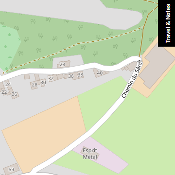

Déplacez la souris sur ce rectangle pour voir l'interface complète:

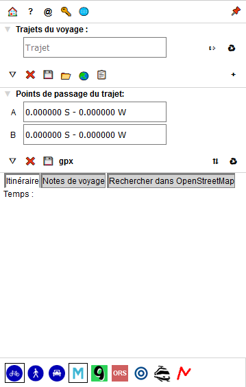

Si vous désirez que l'interface soit toujours visible, cliquez sur le bouton &#x1f4cc;

### Trajets du voyage

Dans cette partie, les différents trajets du voyage ainsi que une barre d'outils sont affichés.

Pour chaque trajet :
- les boutons &#x21e7; et &#x21e9; permettent de modifier l'ordre des différents trajets. Ces boutons ne sont visibles que lorsque plusieurs trajets sont présents.
- Le bouton &#x21f0; commence l'édition d'un trajet.
- Le bouton &#x267b; supprime le trajet.

Il est aussi possible de faire du glisser / déposer pour réordonner les différents trajets.

Lorsque un trajet est chainé, une icône &#x26d3; est présente.

Il est possible de donner un nom à chaque trajet. Cela n'est pas indispensable mais peut vous faciliter la tâche, surtout quand le voyage comporte beaucoup de trajets.

#### Boutons de la barre d'outils "Trajets du voyage"

- le bouton &#x25bd; agrandit la liste des trajets
- le bouton &#x274c; efface toutes les données du voyage et commence l'édition d'un nouveau voyage.
- le bouton &#x1f4be; sauve le voyage en cours d'édition dans un fichier sur votre ordinateur
- le bouton &#x1f4c2; ouvre un voyage préalablement sauvé dans un fichier
- le bouton &#x1F30F; ouvre un voyage préalablement sauvé dans un fichier et inclut tous les trajets et toutes les notes de ce voyage dans le voyage en cours d'édition
- le bouton &#x1f4cb; ouvre le livre de voyage
- le bouton + ajoute un nouveau trajet au voyage

### Points de passage du trajet

Avant de pouvoir visualiser les points de passage d'un trajet, il est nécessaire de commencer l'édition de celui-ci avec le bouton &#x21f0; présent dans la liste des trajets.

#### Boutons de la barre d'outils "Points de passage du trajet"

- le bouton &#x25bd; agrandit la liste des points de passage
- le bouton &#x274c; abandonne l'édition du trajet. Toutes les modifications seront perdues et le trajet restauré dans l'état dans lequel il se trouvait
avant d'être édité
- le bouton &#x1f4be; sauve les modifications faites au trajet.
- le bouton __gpx__ sauve l'itinéraire calculé dans un fichier gpx
- le bouton &#x21c5; inverse l'ordre des points de passage
- Le bouton &#x267b; supprime tous les points de passage

#### Créer un point de passage


Pour créer un point de passage, faites un clic droit sur la carte à l'endroit souhaité et choissisez "Sélectionner cet endroit comme point de départ", "Sélectionner cet endroit comme point intermédiaire"
ou "Sélectionner cet endroit comme point de fin" dans le menu:

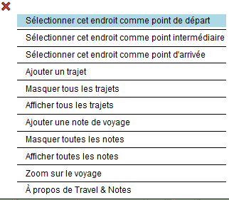

Une icône verte (pour le point de départ), orange (pour un point intermédiaire) ou rouge (pour le point de fin) est ajoutée à la carte à l'endroit choisi et le point de passage complété,
soit avec les coordonnées de l'endroit, soit avec l'adresse.

L'ordre des points de passage est également indiqué (A pour le point de départ, B pour le point d'arrivée et un chiffre pour les points intermédiaires).


- les boutons &#x21e7; et &#x21e9; permettent de modifier l'ordre des points intermédiaires. Ces boutons ne sont visibles que lorsque plusieurs points intermédiaires sont présents. Il
n'est pas possible de transformer le point de départ ou le point de fin en point intermédiaire.
- Le bouton &#x267b; supprime le point de passage. Il n'est pas possible de supprimer le point de départ ou le point de fin.

#### Modifier un point de passage 

Faites un glisser / déposer du point de passage sur la carte pour modifier un point de passage

#### Supprimer un point de passage

Faites un click droit sur le point de passage et choisissez "supprimer ce point de passage" dans le menu. Il n'est pas possible de supprimer le point de départ ni le point de fin. Seul un glisser / déposer est possible.

#### Choisir un mode de parcours et un fournisseur d'itinéraire

Utilisez les boutons dans le bas du contrôle pour modifier le mode de déplacement (vélo, piéton, voiture ou train) ainsi que le fournisseur de trajet.


#### Calcul de l'itinéraire

Lorsque le point de départ et le point de fin sont connus, l'itinéraire est calculé et affiché sur la carte. Il en est de même chaque fois
qu'un point intermédiaire est ajouté ou qu'un point de passage est déplacé.

La description de l'itinéraire est également affichée dans la partie "Itinéraire et notes".

#### Insérer un point intermédiaire.

Lorsque un point intermédiaire est ajouté via le menu contextuel de la carte, il est toujours ajouté comme étant le dernier point intermédiaire. Cela peut donner des résultats 
étranges au niveau de l'itinéraire calculé.

Pour éviter cela, il est également possible d'ajouter un point de passage à un endroit précis du trajet. Faites un clic droit sur le __trajet__ à l'endroit où vous voulez insérer
le point de passage et sélectionner dans le menu contextuel "Ajouter un point de passage à ce trajet". Le nouveau point peut ensuite être déplacé à sa nouvelle position 
avec un glisser / déposer.

#### Sauver ou abandonner les modifications

Lorsque l'édition d'un trajet est terminée, il faut sauver celle-ci.

Il est également possible d'abandonner l'édition d'un trajet et de revenir à la situation avant modifications avec le bouton &#x274c;. Attention, __toutes__ les modifications seront
perdues, y compris les propriétés modifiées et les notes ajoutées depuis le début de l'édition.

### Itinéraire et notes

Cette partie comprend la description de l'itinéraire ainsi que des notes liées au trajet.

Lorsque la souris est placée sur une ligne de l'itinéraire, un marqueur est affiché à cet endroit sur la carte.

Un clic gauche sur une ligne de l'itinéraire zoomera sur l'endroit sur la carte.

Un clic droit sur une ligne de l'itinéraire commencera l'édition d'une nouvelle note liée au trajet, note précomplétée avec les instructions de changement de direction

## __Notes__

Il y a deux sortes de notes: les notes de voyage et les notes de trajet. La position des notes de voyage est totalement libre et elles seront toutes affichées au début du livre de voyage.
Les notes de trajet sont toujours positionnées sur un trajet et affichées avec l'itinéraire dans le livre de voyage.

### Créer une note de voyage

Faite un clic droit à l'endroit souhaité sur la __carte__ et sélectionnez "Ajouter une note" dans le menu contextuel.

### Créer une note de trajet

Faite un clic droit à l'endroit souhaité sur le __trajet__ et sélectionnez "Ajouter une note à ce trajet" dans le menu contextuel.

### consulter une note

Faites un clic gauche sur l'icône de la note.

### Modifier le contenu d'une note

Faites un clic droit sur l'icône de la note et sélectionnez "Éditer cette note" dans le menu contextuel.

### Effacer une note

Faites un clic droit sur l'icône de la note et sélectionnez "Effacer cette note" dans le menu contextuel.

### Déplacer l'icône d'une note

Faites un glisser / déposer de la note. Une ligne sera tracée entre l'icône de la note et le point choisi pour l'insertion de la note. La latitude et longitude de la note 
ne sont pas modifiées.

### Modifier la latitude et la longitude d'une note

Déplacez l'icône de la note pour que la ligne soit visible. Ensuite faites un glisser / déposer de l'extrémité libre de cette ligne.

Une note de trajet a toujours sa latitude et longitude sur le trajet. Lorsque la ligne est déposée, le point le plus proche sur le trajet est recherché et l'extrémité libre
de la ligne déplacé vers ce point.

### Transformer une note de trajet en note de voyage

Faites un clic droit sur l'icône de la note et sélectionnez "Transformer en note de voyage" dans le menu contextuel. La transformation n'est possible que si aucun trajet n'est en cours d'édition.

### Transformer une note de voyage en note de trajet

Faites un clic droit sur l'icône de la note et sélectionnez "Transformer en note de trajet" dans le menu contextuel. La transformation n'est possible que si aucun trajet n'est en cours d'édition.
La note sera attachée au trajet le plus proche de celle-ci.

### La boite d'édition d'une note


Dans le haut de la boite, une liste déroulante permet de choisir des notes prédéfinies. Il est possible de modifier cette liste. Consultez le guide d'installation.

Le premier bouton vous permet de charger votre propre fichier avec des notes prédéfinies dans Travel & Notes. Consultez le guide d'installation pour savoir comment 
créer ce fichier.

Les boutons div p span et a permettent d'ajouter les balises html &lt;div&gt;, &lt;p&gt;, &lt;span&gt; et &lt;a&gt; dans les zones d'édition. Tous les autres boutons sont modifiables et
permettent aussi d'insérer du texte prédéfini dans les zones d'édition. Consultez le guide d'installation.

Chaque zone d'édition peut contenir du texte simple ou du html, à l'exception de la zone "Lien".

La zone "Contenu de l'icône" sera utilisée pour représenter la note sur la carte et ne peut pas être vide (laisser cette zone vide empêcherait toute modification ultérieure de la note).

La zone "Adresse" est complétée automatiquement lors de la création de la note - [Nominatim](http://wiki.openstreetmap.org/wiki/Nominatim) est utilisé pour géolocaliser les notes.
Cette zone ne sera jamais modifiée par Nominatim par la suite, même si la note a été déplacée. Le bouton &#x1f504; permet cependant de demander une nouvelle géolocalisation à Nominatim.

#### Note de trajet prédéfinie "Icône SVG depuis OSM"

Lorsque l'on crée une note de trajet, il est possible de choisir "Icône SVG depuis OSM" dans la liste des notes prédéfinies. Dans ce cas, Travel & Notes va rechercher dans Openstreetmap
l'intersection la plus proche située sur le trajet et va créer une icône en SVG reprenant les rues proches de cette intersection.

L'intersection sera placée au centre de l'icône et le contenu de celle-ci sera orientée en fonction du trajet suivi: la route par laquelle on arrive à l'intersection sera tournée vers le bas de l'icône.

L'adresse sera également modifiée: tous les noms de rue trouvés à l'intersection seront indiqués, séparés par un symbole &#x2AA5;. Le premier nom de rue sera toujours celui par lequel on arrive à l'intersection
et le dernier nom celui par lequel on quitte l'intersection. Ce nom sera précédé d'une flèche indiquant la direction à suivre. Le nom de la commune / ville sera également ajouté. Si un nom de hameau ou de village est 
trouvé à proximité de l'intersection, celui-ci sera également ajouté entre parenthèses.

#### Quleques exemples de notes 

##### Une note simple créée à partir d'une note prédéfinie

La boite de dialogue: 

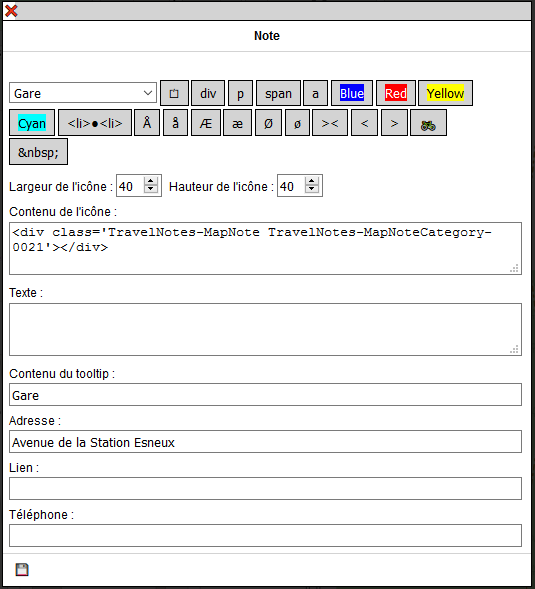

Et le résultat dans TravelNotes:

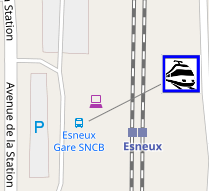

##### Une note de trajet créée avec "Icône SVG depuis OSM"

Le trajet va de la droite vers la gauche. L'intersection des rues Tiyou d'Hestreu, Chemin des Patars et Basse Voie se trouve au centre de l'icône.
Les rues sont orientées de telle sorte que une personne qui suit le trajet sur le terrain voit les rues dans la même position que sur l'icône.
La rue par laquelle on arrive est le Tiyou d'Hestreu. Une flèche vers la droite indique qu'il faut tourner à droite dans la Basse Voie.
Nous sommes dans la commune de Anthisnes et au hameau de Limont.

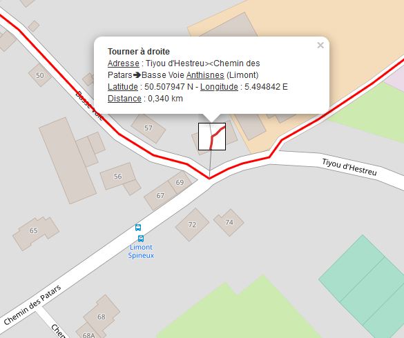

##### Une note avec un texte sur une ligne

La boite de dialogue: 

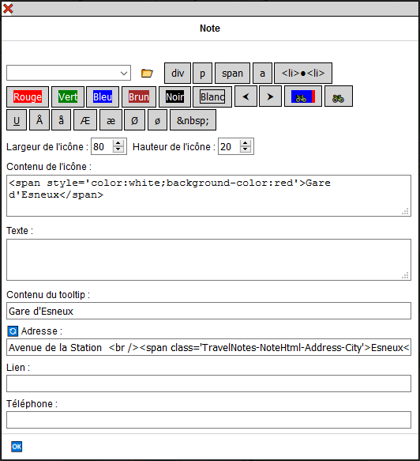

Et le résultat dans TravelNotes:

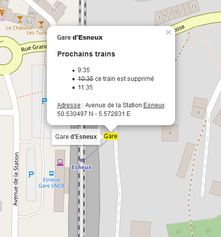

##### Une note avec une photo

La boite de dialogue: 

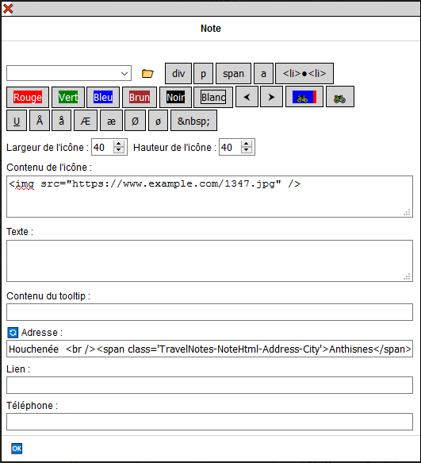

Et le résultat dans TravelNotes:

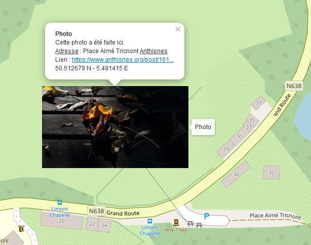

### La boite d'édition des propriétés d'un trajet

Faites un clic droit sur le trajet et sélectionnez "Propriétés" dans le menu contextuel.

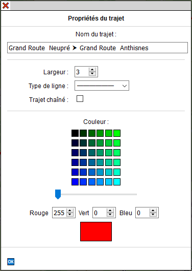

Les 6 premières rangées de boutons de couleur permettent de sélectionner la couleur utilisée pour afficher le trajet. La dernière rangée de boutons de couleur ajoute plus ou moins 
de nuance de rouge dans les couleurs proposées.

Chaque nuance de rouge, vert et bleu pour la couleur désirée peut également être réglée individuellement via les 3 zones d'édition des couleurs.

Il est également possible de modifier la largeur du trajet ainsi que le type de ligne et également chainer le trajet au voyage.

### Déplacer une boite d'édition sur l'écran.

Parfois, une boite d'édition peut masquer un objet de la carte que l'on désire consulter. Il est toujours possible de glisser / déposer une boite d'édition en la saississant par
la barre dans la partie supérieure.

## __Livre de voyage__

Cliquez sur le bouton &#x1f4cb;. Un nouvel onglet est créé avec le livre de voyage. Celui-ci contient tous les trajets ainsi que toutes les notes qui ont été
créées sur la carte. Il est possible de choisir ce que l'on désire voir présent dans le livre de voyage via le menu en haut de page :


Le bouton "Enrégistrer" permet de sauver le fichier html sur votre PC.

## Préparer un voyage et le consulter depuis internet

Il est possible de préparer un voyage, sauver celui-ci dans un fichier sur un serveur web et consulter celui-ci depuis internet.

Pour consulter le voyage, il faut appeler TravelNotes en lui donnant en paramètre dans l'url l'adresse du fichier convertie en base64.

```
https://wwwouaiebe.github.io/leaflet.TravelNotes/?fil=aHR0cHM6Ly93d3dvdWFpZWJlLmdpdGh1Yi5pby9zYW1wbGUudHJ2
```

aHR0cHM6Ly93d3dvdWFpZWJlLmdpdGh1Yi5pby9zYW1wbGUudHJ2 en l'équivalent de https://wwwouaiebe.github.io/sample.trv encodé en base64

Voir l'exemple sur la [démo](https://wwwouaiebe.github.io/leaflet.TravelNotes/?fil=aHR0cHM6Ly93d3dvdWFpZWJlLmdpdGh1Yi5pby9zYW1wbGUudHJ2)

Quand un tel fichier est affiché, il n'est pas possible de modifier celui-ci. Le contrôle n'est pas visible et tous les menus contextuels sont désactivés.
