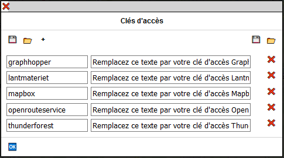
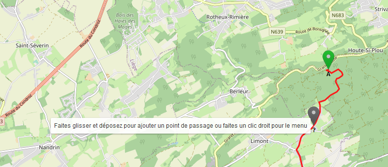
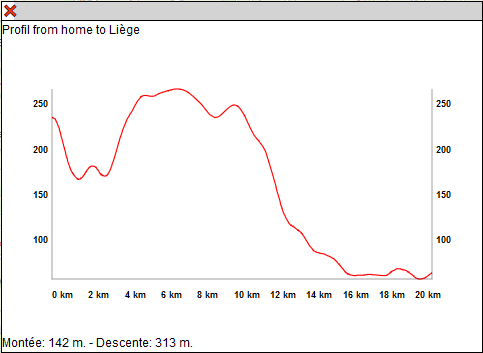
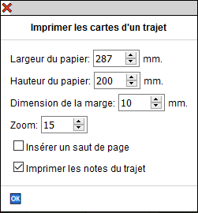
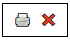
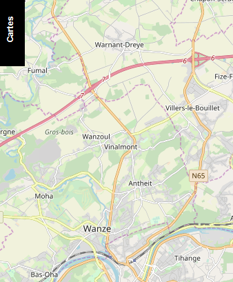
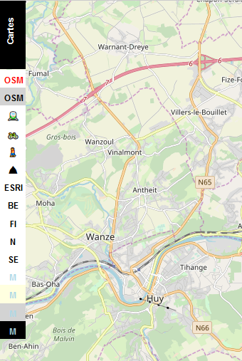

# Travel & Notes - Guide de l'utilisateur

- [Pourquoi Travel & Notes](#WhyTravelNotes)
- [Quelques explications sur les termes utilisés](#SomeExplanations)
- [Avant de commencer à utiliser Travel & Notes](#BeforeStart)
	- [Comment introduire vos clefs d'accès dans Travel & Notes](#APIKeys)
- [Interface](#Interface1)
	- [Barre d'outils en haut de l'interface](#InterfaceToolbar)
	- [Trajets du voyage](#RoutesTravel)
		- [Boutons de la barre d'outils "Trajets du voyage"](#RouteToolbar)
	- [Points de passage du trajet](#RouteWayPoints)
		- [Boutons de la barre d'outils "Points de passage du trajet"](#WayPointsToolbar)
	- [Itinéraire et notes](#ItineraryAndNotes)
	- [Barre d'outils des modes de parcours et des fournisseurs d'itinéraire](#RouterButtons)
- [Boites d'édition](#EditBoxes)
	- [Déplacer une boite d'édition sur l'écran](#MoveEditBox)	
- [Trajets et points de passage](#routes)	
	- [Créer un point de passage](#AddWayPoint)
	- [Ajouter un point de passage avec un glisser/déposer ](#AddWayPointDragDrop)
	- [Modifier un point de passage ](#ModifyWayPoint)
	- [Supprimer un point de passage](#DeleteWayPoint)
	- [Choisir un mode de parcours et un fournisseur d'itinéraire](#ItineraryModeAndProvider)
	- [Calcul de l'itinéraire](#ComputingItinerary)
	- [Sauver ou abandonner les modifications](#SaveOrDiscardRoute)
	- [Profil d'un trajet](#RouteProfile)
	- [Itinéraire en train](#TrainItinerary)
	- [La boite d'édition des propriétés d'un trajet](#RouteDlg)
	- [Imprimer les cartes d'un trajet](#PrintRouteMaps)
- [Notes](#Notes1)
	- [Créer une note de voyage](#NewTravelNote)
	- [Créer une note de trajet](#NewRouteNote)
	- [Consulter une note](#ViewNote)
	- [Modifier le contenu d'une note](#ModifyNote)
	- [Effacer une note](#DeleteNote)
	- [Déplacer l'icône d'une note](#MoveNote)
	- [Modifier la latitude et la longitude d'une note](#LatLngNote)
	- [Transformer une note de trajet en note de voyage](#RouteToTravelNote)
	- [Transformer une note de voyage en note de trajet](#TravelToRouteNote)
	- [Créer une note pour chaque manoeuvre du trajet](#AllManeuverNotesFromOsm)
	- [La boite d'édition d'une note](#NoteDlg)
		- [Note de trajet prédéfinie "Icône SVG depuis OSM"](#SvgNoteFromOsm)
		- [Quelques exemples de notes](#NoteSamples)
- [Menu des fonds de carte](#MapsMenu)
- [Livre de voyage](#Roadbook)
- [Préparer un voyage et le consulter depuis internet](#PrepareTravel)
- [Viewer](#Viewer)

<a id="WhyTravelNotes"></a>
## __Pourquoi Travel & Notes__

Je pars de temps en temps en voyage en vélo pour plusieurs semaines, parfois dans des régions isolées. 
Ce genre de voyage ne s'improvise pas, même si il y a toujours une part d'imprévu. 
Il me fallait un outil pour préparer mon itinéraire à partir de la carte et pouvoir y ajouter des notes.

Oui, je sais, il y a des tas d'applications qui permettent de faire un itinéraire d'un point à un autre,
mais aucune ne me donne vraiment satisfaction: je ne cherche pas souvent le trajet le plus 
court - parfois il s'agit même d'un trajet circulaire - et en général on est limité à quelques centaines 
de kilomètres.

En final , il est aussi important de pouvoir enrégistrer ce qui a été préparé car cela ne se fait pas
en quelques minutes.Il faut aussi pouvoir imprimer le résultat. Dans certaines région isolées,
il n'y a pas toujours de réseau mobile ni de possibilité de recharger une batterie. 
Une bonne vieille copie papier est souvent précieuse.

<a id="SomeExplanations"></a>
## __Quelques explications sur les termes utilisés__

Un **trajet** relie deux points. Sur la carte, il est représenté par une polyligne.

Un **itinéraire** est la description des différents changements de direction nécessaires pour 
parcourir le trajet. Chaque changement de direction est une **manœuvre**.

Un **voyage** est constitué de un ou plusieurs trajets. Ceux-ci ne doivent pas obligatoirement 
se toucher à leur extrémités. Il peut également y avoir plus de deux trajets partant d'un même point.

Dans un voyage, certains trajets peuvent être **chainés** entre eux. Dans ce cas les différents 
trajets chainés seront considérés comme n'en faisant qu'un seul pour le calcul des distances. 
Une seule chaine peut-être créée par voyage, mais il n'est pas obligatoire que tous 
les trajets soient inclus dans la chaine.

Une **note** est un ensemble d'informations qui concerne un point précis sur la carte ou sur un trajet. 
Une note est composée d'une icône, d'un 'tooltip', d'un texte libre, d'une adresse, d'un lien et 
d'un numéro de téléphone. Aucune de ces informations n'est obligatoire, à l'exception de l'icône,
qui est utilisée pour représenter la note sur la carte. Cette icône peut être une image,
une photo, un texte...

Le **livre de voyage** est une page HTML qui regroupe toute l'information du voyage: les notes, 
les trajets et les itinéraires.

<a id="BeforeStart"></a>
## __Avant de commencer à utiliser Travel & Notes__

Si vous utilisez Travel & Notes uniquement pour créer des notes, vous pouvez ignorer toute la partie 
qui concernent les clefs d'accès. Celles-ci ne sont utilisées que pour le calcul des trajets et 
l'affichage de certaines cartes.

Travel & Notes ne calcule pas lui-même les itinéraires des trajets. Il se connecte chez un fournisseur 
d'itinéraires pour obtenir cet itinéraire. Les différents fournisseurs d'itinéraire qu'il est possible 
d'utiliser actuellement sont GraphHopper, Stadia Maps, Mapbox, OpenRouteService et OSRM. 
Il est également possible de tracer une polyligne entre deux endroits, sans suivre de chemins. 
Un itinéraire en train entre deux gares peut aussi être ajouté, à condition que cet itinéraire 
soit encodé dans Openstreetmap, en respectant les règles des transports publics version 2.

Pour GraphHopper, Stadia Maps, OpenRouteService et Mapbox il est nécessaire de posséder une clef d'accès ( **API Key** )
pour se connecter au serveur. Consultez les sites internet de ces différents fournisseurs pour obtenir 
une clef d'accès.

Pour l' affichage de certaines cartes (Thunderforest, Lantmäteriet - Suède, Mapbox), une clef d'accès 
est également indispensable. Pour d'autres cartes, ce n'est pas nécessaire (OpenStreetMap, 
vue aérienne ESRI, IGN - Belgique, Kartverket - Norvège, Maanmittauslaitos - Finlande).

Vous devez également lire correctement  les conditions d'utilisation des clefs d'accès et vérifier 
que ce que vous faites avec Travel & Notes correspond à ces conditions d'utilisation.

Vous êtes également responsable de l'utilisation qui est faite de vos clefs d'accès. N'oubliez pas 
qu'il peut y avoir une facturation qui est faite sur la base de ces clefs d'accès. Ne les donnez pas 
à n'importe qui, ne les laissez pas trainer n'importe où.

<a id="APIKeys"></a>
### Comment introduire vos clefs d'accès dans Travel & Notes

Les clefs d'accès sont gérées à partir de la boite de dialogue des clefs d'accès. Pour afficher celle-ci,
cliquez sur le bouton 🔑 dans la barre d'outil en haut de l'interface.



Pour chaque fournisseur de service, vous devez indiquer à gauche le nom de ce fournisseur  et à droite 
la clef d' accès. Les différents noms possibles actuellement sont 'GraphHopper', 'Ign', 'Lantmateriet',
'Mapbox', 'MapzenValhalla', 'OpenRouteService' et 'Thunderforest' (insensible au majuscules/minuscules).

Utilisez le bouton + pour ajouter un fournisseur de service et le bouton ❌ à droite pour 
supprimer celui-ci.

Quand vos clefs d'accès sont introduites, appuyez sur le bouton 🆗 pour terminer. 
Vos clefs sont sauvegardées dans le "sessionStorage" du browser et disponibles jusqu'à la fermeture 
de celui-ci.

Il est possible de sauvegarder les clefs d'accès dans un fichier, protégé par un mot de passe ou non protégé.

**Attention**: la page doit être servie en HTTPS pour sauvegarder dans un fichier protégé par un mot de passe.

Le bouton :arrows_counterclockwise: permet de recharger le fichier des clefs d'accès depuis le serveur web.

Le bouton :floppy_disk: à **gauche** de la boite de dialogue permet de sauver les clefs d'accès 
dans un fichier protégé par mot de passe. Celui-ci doit contenir au moins 12 caractères dont
au moins une majuscule, une minuscule, un chiffre et un autre caractère.

Le bouton :file_folder: à **gauche** de la boite de dialogue remplace toutes les clefs d'accès de la
boite de dialogue par le contenu d'un fichier protégé par mot de passe.

Ces deux boutons ne sont présents que si toutes les conditions pour pouvoir sauvegarder/restaurer les 
clefs avec un mot de passe sont réunies.

Le bouton :floppy_disk: à **droite** de la boite de dialogue permet de sauver les clefs d'accès dans 
un fichier **non protégé** par mot de passe.

Le bouton :file_folder: à **droite** de la boite de dialogue remplace toutes les clefs d'accès de la 
boite de dialogue par le contenu d'un fichier **non protégé** par mot de passe.

Si un fichier protégé par un mot de passe et nommé **APIKeys** est placé dans le même répertoire que 
Travel & Notes sur le serveur, Travel & Notes vous demandera le mot de passe à l'ouverture pour 
pouvoir utiliser les clefs contenues dans ce fichier.

Pour les geeks et les paranos voyez aussi ,dans le [guide d'installation](GuideInstallationFR.md#TravelNotesConfigJson) et dans le fichier 
TravelNotesConfig.json:
- APIKeys.showDialogButton pour afficher ou masquer le bouton :key: dans la barre d'outils
- APIKeys.saveToSessionStorage pour sauver ou non les clefs dans le sessionStorage
- APIKeys.showAPIKeysInDialog pour montrer ou masquer les clefs comme un mot de passe dans la boite 
de dialogue
- APIKeys.dialogHaveUnsecureButtons pour afficher ou masquer les boutons :floppy_disk: 
et :file_folder: à __droite__

L'ancienne méthode consistant à introduire les clefs d'accès via l'url continue à fonctionner:
- à la fin de l'url de la page web chargeant Travel & Notes, vous devez introduire un ? suivi 
du nom du fournisseur suivi de ProviderKey suivi de = suivi de votre clef d'accès. 
Plsieurs clef d'accès peuvent être introduites simultanément en les séparants par un &.

Exemple:
```
https://www.example.org/TravelNotes/?MapboxProviderKey=votre_clef_accessMapbox&GraphHopperProviderKey=votre_clef_acces_GraphHopper
```

Dès que Travel & Notes détecte des clefs d'accès dans l'url, celles-ci sont enrégistrées dans 
le _sessionStorage_ et effacée de l'url. Elles ne sont donc plus visibles à l'écran.
**Cependant, rappelez-vous qu'une personne mal intentionnée peut toujours les retrouver dans 
l'historique du navigateur**, à moins que vous n'utilisiez le mode navigation privée de votre browser.

<a id="Interface1"></a>
## __Interface__

Lorsque la carte s'affiche, seul un petit rectangle noir est est visible dans le coin supérieur de la carte:


Déplacez la souris sur ce rectangle pour voir l'interface complète:


<a id="InterfaceToolbar"></a>
### Barre d'outils en haut de l'interface

En haut de l'interface se trouve une première barre d'outils:
- le bouton :house: redirige vers votre page d'accueil
- le bouton ? redirige vers 
[la page d'aide sur Github](https://github.com/wwwouaiebe/leaflet.TravelNotes/tree/gh-pages/TravelNotesGuides)
- le bouton @ redirige vers une page de contact. Par défaut, c'est 
[la page des issues de Travel & Notes sur Github](https://github.com/wwwouaiebe/leaflet.TravelNotes/issues).
L'url peut être modifiée via le fichier TravelNotesConfig.json (travelNotesToolbarUI.contactMail)
- le bouton :key: affiche la boite de dialogue des clefs d'accès
- le bouton :globe_with_meridians: active ou désactive la localisation. 
- le bouton :pushpin: affiche l'interface en permanence.

<a id="RoutesTravel"></a>
### Trajets du voyage

Dans cette partie, les différents trajets du voyage ainsi que une barre d'outils sont affichés.

Pour chaque trajet :
- les boutons &#x21e7; et &#x21e9; permettent de modifier l'ordre des différents trajets. 
Ces boutons ne sont visibles que lorsque plusieurs trajets sont présents.
- Le bouton &#x21f0; commence l'édition d'un trajet.
- Le bouton :recycle: supprime le trajet.

Il est aussi possible de faire du glisser / déposer pour réordonner les différents trajets.

Lorsque un trajet est chainé, une icône &#x26d3; est présente à gauche de celui-ci.

Il est possible de donner un nom à chaque trajet. Cela n'est pas indispensable mais peut vous 
faciliter la tâche, surtout quand le voyage comporte beaucoup de trajets.

<a id="RouteToolbar"></a>
#### Boutons de la barre d'outils "Trajets du voyage"

- le bouton &#x25bd; agrandit la liste des trajets
- le bouton :x: efface toutes les données du voyage et commence l'édition d'un nouveau voyage.
- le bouton :floppy_disk: sauve le voyage en cours d'édition dans un fichier sur votre ordinateur
- le bouton :file_folder: ouvre un voyage préalablement sauvé dans un fichier
- le bouton :earth_asia: ouvre un voyage préalablement sauvé dans un fichier et inclut tous les trajets 
et toutes les notes de ce voyage dans le voyage en cours d'édition
- le bouton :clipboard: ouvre le livre de voyage
- le bouton + ajoute un nouveau trajet au voyage

<a id="RouteWayPoints"></a>
### Points de passage du trajet

Avant de pouvoir visualiser les points de passage d'un trajet, il est nécessaire de commencer 
l'édition de celui-ci avec le bouton &#x21f0; présent dans la liste des trajets.

À noter que, quand Travel & Notes est lancé, le premier trajet est directement édité. Il en est de 
même quand un nouveau trajet est créé et que le trajet en cours d'édition n'a pas encore été modifié.

<a id="WayPointsToolbar"></a>
#### Boutons de la barre d'outils "Points de passage du trajet"

- le bouton &#x25bd; agrandit la liste des points de passage
- le bouton :x: abandonne l'édition du trajet. Toutes les modifications seront perdues et le 
trajet restauré dans l'état dans lequel il se trouvait avant d'être édité
- le bouton :floppy_disk: sauve les modifications faites au trajet.
- le bouton __gpx__ sauve l'itinéraire calculé dans un fichier gpx
- le bouton &#x21c5; inverse l'ordre des points de passage
- Le bouton :recycle: supprime tous les points de passage

<a id="ItineraryAndNotes"></a>
### Itinéraire et notes

Cette partie comprend la description de l'itinéraire ainsi que des notes liées au trajet.

Lorsque la souris est placée sur une ligne de l'itinéraire, un marqueur est affiché à cet endroit sur 
la carte.

Un clic gauche sur une ligne de l'itinéraire zoomera sur l'endroit sur la carte.

Un clic droit sur une ligne de l'itinéraire commencera l'édition d'une nouvelle note liée au trajet, 
note précomplétée avec les instructions de changement de direction.

<a id="RouterButtons"></a>
### Barre d'outils des modes de parcours et des fournisseurs d'itinéraire

Les différents modes de parcours (vélo, piéton, voiture,train ou ligne) ainsi que les différents 
fournisseurs d'itinéraires sont sélectionnés sur cette barre d'outils.


Les boutons bleus à gauche permettent de sélectionner le mode de parcours, les autres boutons 
sélectionnent les fournisseurs d'itinéraire.

Seuls les boutons utilisables sont visibles dans la barre d'outils:
- les modes de parcours dépendent du fournisseur d'itinéraire sélectionné
- un fournisseur d'itinéraire n'est présent que si le plugin correspondant est installé
et si la clef d'accès pour ce fournisseur est connue (qund une clef d'accès est nécessaire).

<a id="EditBoxes"></a>
## Boites d'édition

Parfois, une boite d'édition peut masquer un objet de la carte que l'on désire consulter. Il est 
toujours possible de glisser / déposer une boite d'édition en la saississant par la barre dans la 
partie supérieure.

<a id="Routes"></a>
## Trajets et points de passage

Pour ajouter, modifier ou supprimer des points de passage, il est nécessaire d'éditer le trajet depuis l'interface
ou via le menu contextuel du trajet si celui-ci existe déjà.

Toutes les autres modifications (notes, propriétés ou nom du trajet) peuvent se faire, que le trajet 
soit édité ou non.

<a id="AddWayPoint"></a>
### Créer un point de passage

Pour créer un point de passage, faites un clic droit sur la carte à l'endroit souhaité et choissisez
"Sélectionner cet endroit comme point de départ", "Sélectionner cet endroit comme point intermédiaire"
ou "Sélectionner cet endroit comme point de fin" dans le menu:


Une icône verte (pour le point de départ), orange (pour un point intermédiaire) ou 
rouge (pour le point de fin) est ajoutée à la carte à l'endroit choisi et le point de passage complété,
soit avec les coordonnées de l'endroit, soit avec l'adresse.

Un point intermédiaire ajouté via le menu contextuel sera toujours ajouté à la fin de la 
liste des points intermédiaires.

L'ordre des points de passage est également indiqué (A pour le point de départ, B pour le point 
d'arrivée et un chiffre pour les points intermédiaires).


- les boutons &#x21e7; et &#x21e9; permettent de modifier l'ordre des points intermédiaires. 
Ces boutons ne sont visibles que lorsque plusieurs points intermédiaires sont présents. Il
n'est pas possible de transformer le point de départ ou le point de fin en point intermédiaire.
- Le bouton :recycle: supprime le point de passage. Il n'est pas possible de supprimer le point de 
départ ou le point de fin.

<a id="AddWayPointDragDrop"></a>
### Ajouter un point de passage avec un glisser/déposer

Amenez la souris sur le trajet pour voir apparaître un point de passage temporaire gris.
En faisant ensuite un glisser / déposer de celui-ci, le point de passage est ajouté au trajet.



<a id="ModifyWayPoint"></a>
### Modifier un point de passage 

Faites un glisser / déposer du point de passage sur la carte pour modifier un point de passage

<a id="DeleteWayPoint"></a>
### Supprimer un point de passage

Faites un click droit sur le point de passage et choisissez "supprimer ce point de passage" dans le menu.
Il n'est pas possible de supprimer le point de départ ni le point de fin. Seul un glisser / déposer 
est possible.

<a id="ItineraryModeAndProvider"></a>
### Choisir un mode de parcours et un fournisseur d'itinéraire

Utilisez les boutons dans le bas du contrôle pour modifier le mode de déplacement (vélo, piéton, 
voiture ou train) ainsi que le fournisseur de trajet.


<a id="ComputingItinerary"></a>
### Calcul de l'itinéraire

Lorsque le point de départ et le point de fin sont connus, l'itinéraire est calculé et affiché sur 
la carte. Il en est de même chaque fois qu'un point intermédiaire est ajouté ou qu'un point de 
passage est déplacé.

La description de l'itinéraire est également affichée dans la partie "Itinéraire et notes".

<a id="SaveOrDiscardRoute"></a>
### Sauver ou abandonner les modifications

Lorsque l'édition d'un trajet est terminée, il faut sauver celle-ci avec le bouton :floppy_disk:.

Il est également possible d'abandonner l'édition d'un trajet et de revenir à la situation avant 
modifications avec le bouton :x:. Attention, __toutes__ les modifications seront
perdues, y compris les propriétés modifiées et les notes ajoutées depuis le début de l'édition.

Sauver ou abandonner les modifications peut aussi se faire depuis le menu contextuel du trajet.

<a id="RouteProfile"></a>
### Profil d'un trajet

Lorsque un trajet est calculé avec GraphHopper ou OpenRouteService, il est possible d'afficher un profil de ce trajet.
Faites un clic droit sur le __trajet__ et sélectionnez "Voir le profil du trajet" dans le menu contextuel.



Il peut y avoir plusieurs fenêtres affichant des profils ouvertes.

Il est possible de déplacer un profil sur l'écran en faisant un glisser/déposer de la barre supérieure de la fenêtre.

<a id="TrainItinerary"></a>
### Itinéraire en train

Reportez vous à la [documentation de leaflet.TravelNotesPublicTransport](https://github.com/wwwouaiebe/leaflet.TravelNotesPublicTransport/blob/master/README.md)
pour plus d'explications sur la façon de créer un itinéraire en train.

<a id="RouteDlg"></a>
### La boite d'édition des propriétés d'un trajet

Faites un clic droit sur le trajet et sélectionnez "Propriétés" dans le menu contextuel.


Les 6 premières rangées de boutons de couleur permettent de sélectionner la couleur utilisée pour 
afficher le trajet. La dernière rangée de boutons de couleur ajoute plus ou moins 
de nuance de rouge dans les couleurs proposées.

Chaque nuance de rouge, vert et bleu pour la couleur désirée peut également être réglée individuellement 
via les 3 zones d'édition des couleurs.

Il est également possible de modifier la largeur du trajet ainsi que le type de ligne et également 
chainer le trajet au voyage.

<a id="PrintRouteMaps"></a>
### Imprimer les cartes d'un trajet

Attention: cette commande est expérimentale. Elle peut ne pas fonctionner avec votre installation de Travel & Notes
si vous avez ajouté d'autres éléments à la page. De plus, tous les browsers n'ont pas implémenté toutes
les balises css nécessaires. Si cette commande ne vous convient pas, vous pouvez la désactiver à partir 
du fichier TravelNotesConfig.json (printRouteMap.isEnabled). 
Voir le [guide d'installation](GuideInstallationFR.md#TravelNotesConfigJson).

Faites un clic droit sur le trajet pour lequel vous voulez imprimer les cartes et sélectionnez 
"Imprimer les cartes de ce trajet" dans le menu contextuel.

La boite d'édition est affichée:



"Largeur du papier" et "hauteur du papier": il s'agit de la largeur et hauteur de la zone imprimable
du papier. Vous devez contrôler celle-ci avec votre imprimante.

"Dimension de la marge": c'est une zone autour de la carte et à l'interieur de celle-ci qui sera réimprimée 
dans la carte suivante.

"Zoom" : le zoom à utiliser pour les cartes. Il est indépendant du zoom utilisé pour afficher la carte 
avant le lancement de la commande. Pour des raisons de performance des serveurs de tuiles, il n'est
pas possible d'utiliser un zoom plus grand que 15.

"Insérer un saut de page": quand cette case est cochée, un saut de page est inséré après chaque carte.

"Imprimer les notes du trajet" quand cette case est cochée, l'icône des notes est imprimée sur la carte.

Lorsque la boite d'édition est fermée avec le bouton "ok", la carte et les contrôles sont remplacés par
des vues de la carte qui ont les dimensions souhaitées et deux boutons sont présents en haut à droite:



Le bouton &#x1F5A8;&#xFE0F; lancera la commande d'impression de votre browser et le bouton &#x274c;
annulera l'impression et réaffichera la carte.

Lorsque la commande d'impression du browser est fermée, les vues d'impression seront également fermées 
et la carte réaffichée.

Toutes les valeurs par défaut de la boite d'édition peuvent être modifiées dans le fichier TravelNotesConfig.json.
Voir le [guide d'installation](GuideInstallationFR.md#TravelNotesConfigJson).

Évitez de surcharger les serveurs de tuiles. Ne lancez cette commande que si vous en avez réellement besoin.
Diminuer les dimensions du papier, la dimension de la marge et le zoom diminuera également le nombre de tuiles
nécessaires.

Lorsque la boite d'édition est fermée, le programme calcule le nombre de tuiles nécessaires. Si ce nombre est
trop important, la commande est arrêtée.

#### Quelques astuces pour imprimer avec un browser basé sur Chrome ( Brave, Vivaldi, MS Edge dernière version, Chromium, Chrome )

- Cochez la case "Insérer un saut de page"
- indiquez comme "hauteur de papier" la hauteur réelle de votre papier moins les marges d'impression haut et bas
moins 1 mm
- pour les geeks: vous pouvez insérer un fichier css dans la page html avec une règle css @page pour fixer les
dimensions, orientation et marges du papier:

```
@page {
  size: A4 landscape;
  margin: 7mm;
}
```

#### Quelques astuces pour imprimer avec Firefox

- Ne jamais cocher la case "Insérer un saut de page" ni utiliser une règle css @page. Si vous faites cela,
le trajet ne sera pas imprimé correctement après le saut de page.
- indiquez comme "hauteur de papier" la hauteur réelle de votre papier moins les marges d'impression haut et bas
moins 1 mm (à vérifier avec votre imprimante...). Vérifiez que tout est correct avec la commande "Aperçu avant impression"
de Firefox.

<a id="Notes1"></a>
## __Notes__

Il y a deux sortes de notes: les notes de voyage et les notes de trajet. La position des notes de voyage 
est totalement libre et elles seront toutes affichées au début du livre de voyage.
Les notes de trajet sont toujours positionnées sur un trajet et affichées avec l'itinéraire dans le 
livre de voyage.

<a id="NewTravelNote"></a>
### Créer une note de voyage

Faite un clic droit à l'endroit souhaité sur la __carte__ et sélectionnez "Ajouter une note" dans le 
menu contextuel.

<a id="NewRouteNote"></a>
### Créer une note de trajet

Faite un clic droit à l'endroit souhaité sur le __trajet__ et sélectionnez "Ajouter une note à ce trajet" 
dans le menu contextuel.

<a id="ViewNote"></a>
### Consulter une note

Faites un clic gauche sur l'icône de la note.

<a id="ModifyNote"></a>
### Modifier le contenu d'une note

Faites un clic droit sur l'icône de la note et sélectionnez "Éditer cette note" dans le menu contextuel.

<a id="DeleteNote"></a>
### Effacer une note

Faites un clic droit sur l'icône de la note et sélectionnez "Effacer cette note" dans le menu contextuel.

<a id="MoveNote"></a>
### Déplacer l'icône d'une note

Faites un glisser / déposer de la note. Une ligne sera tracée entre l'icône de la note et le point 
choisi pour l'insertion de la note. La latitude et longitude de la note ne sont pas modifiées.

<a id="LatLngNote"></a>
### Modifier la latitude et la longitude d'une note

Déplacez l'icône de la note pour que la ligne soit visible. Ensuite faites un glisser / déposer de 
l'extrémité libre de cette ligne.

Une note de trajet a toujours sa latitude et longitude sur le trajet. Lorsque la ligne est déposée, 
le point le plus proche sur le trajet est recherché et l'extrémité libre de la ligne déplacé vers ce point.

<a id="RouteToTravelNote"></a>
### Transformer une note de trajet en note de voyage

Faites un clic droit sur l'icône de la note et sélectionnez "Transformer en note de voyage" dans le menu 
contextuel. La transformation n'est possible que si aucun trajet n'est en cours d'édition.

<a id="TravelToRouteNote"></a>
### Transformer une note de voyage en note de trajet

Faites un clic droit sur l'icône de la note et sélectionnez "Transformer en note de trajet" dans le menu 
contextuel. La transformation n'est possible que si aucun trajet n'est en cours d'édition. La note sera 
attachée au trajet le plus proche de celle-ci.

<a id="AllManeuverNotesFromOsm"></a>
### Créer une note pour chaque manoeuvre du trajet

Faites un clic droit sur le trajet et sélectionnez "Créer une note pour chaque manoeuvre du trajet" dans le menu 
contextuel. Une demande de confirmation est affichée. 
Pour chaque manoeuvre du trajet, [une note en SVG à partir des données OpenStreetMap ](#SvgNoteFromOsm) sera créée.

<a id="NoteDlg"></a>
### La boite d'édition d'une note


Dans le haut de la boite, une liste déroulante permet de choisir des notes prédéfinies. Il est possible 
de modifier cette liste. Consultez le [guide d'installation](GuideInstallationFR.md#TravelNotesNoteDialogJson).

Le bouton :file_folder: vous permet de charger votre propre fichier avec des notes prédéfinies dans 
Travel & Notes. Consultez le [guide d'installation](GuideInstallationFR.md#TravelNotesNoteDialogJson). pour savoir comment créer ce fichier.

Les boutons div p span et a permettent d'ajouter les balises html &lt;div&gt;, &lt;p&gt;, &lt;span&gt;
et &lt;a&gt; dans les zones d'édition. Tous les autres boutons sont modifiables et permettent aussi 
d'insérer du texte prédéfini dans les zones d'édition. [guide d'installation](GuideInstallationFR.md#TravelNotesNoteDialogJson).

Chaque zone d'édition peut contenir du texte simple ou du html, à l'exception de la zone "Lien".

La zone "Contenu de l'icône" sera utilisée pour représenter la note sur la carte et ne peut pas être 
vide (laisser cette zone vide empêcherait toute modification ultérieure de la note).

La zone "Adresse" est complétée automatiquement lors de la création de la note - 
[Nominatim](http://wiki.openstreetmap.org/wiki/Nominatim) est utilisé pour géolocaliser les notes.
Cette zone ne sera jamais modifiée par Nominatim par la suite, même si la note a été déplacée. 
Le bouton :arrows_counterclockwise: permet cependant de demander une nouvelle géolocalisation à Nominatim.

<a id="SvgNoteFromOsm"></a>
#### Note de trajet prédéfinie "Icône SVG depuis OSM"

Lorsque l'on crée une note de trajet, il est possible de choisir "Icône SVG depuis OSM" dans la 
liste des notes prédéfinies. Dans ce cas, Travel & Notes va rechercher dans Openstreetmap
l'intersection la plus proche située sur le trajet et va créer une icône en SVG reprenant les rues 
proches de cette intersection.

L'intersection sera placée au centre de l'icône et le contenu de celle-ci sera orientée en fonction 
du trajet suivi: la route par laquelle on arrive à l'intersection sera tournée vers le bas de l'icône.

L'adresse sera également modifiée: tous les noms de rue trouvés à l'intersection seront indiqués, 
séparés par un symbole &#x2AA5;. Le premier nom de rue sera toujours celui par lequel on arrive à 
l'intersection et le dernier nom celui par lequel on quitte l'intersection. Ce nom sera précédé 
d'une flèche indiquant la direction à suivre. Le nom de la commune / ville sera également ajouté. 
Si un nom de hameau ou de village est trouvé à proximité de l'intersection, celui-ci sera également
ajouté entre parenthèses.

<a id="NoteSamples"></a>
#### Quelques exemples de notes 

##### Une note simple créée à partir d'une note prédéfinie

La boite de dialogue: 


Et le résultat dans TravelNotes:


##### Une note de trajet créée avec "Icône SVG depuis OSM"

Le trajet va de la droite vers la gauche. L'intersection des rues Tiyou d'Hestreu, Chemin des Patars 
et Basse Voie se trouve au centre de l'icône. Les rues sont orientées de telle sorte que une personne 
qui suit le trajet sur le terrain voit les rues dans la même position que sur l'icône.
La rue par laquelle on arrive est le Tiyou d'Hestreu. Une flèche vers la droite indique qu'il faut 
tourner à droite dans la Basse Voie.
Nous sommes dans la commune de Anthisnes et au hameau de Limont.


##### Une note avec un texte sur une ligne

La boite de dialogue: 


Et le résultat dans TravelNotes:


##### Une note avec une photo

La boite de dialogue: 


Et le résultat dans TravelNotes:


<a id="MapsMenu"></a>
## __Menu des fonds de carte__

À gauche de l'écran une barre d'outils permet de choisir différents fond de cartes. Seul un petit 
rectangle noir est visible à l'écran:



Amenez la souris sur ce rectangle pour afficher toute la barre d'outils:



Pour chaque fond de carte un bouton est présent dans la barre d'outils. La composition de la barre 
d'outils dépend des cartes définies dans le fichier TravelNotesLayers.json ainsi que des clefs 
d'accès qui ont été introduites. Consultez le [guide d'installation](GuideInstallationFR.md#TravelNotesLayersJson).

Il est possible de se déplacer dans la barre d'outils en utilisant la roulette de la souris.

<a id="Roadbook"></a>
## __Livre de voyage__

Cliquez sur le bouton :clipboard:. Un nouvel onglet est créé avec le livre de voyage. Celui-ci contient 
tous les trajets ainsi que toutes les notes qui ont été créées sur la carte. Il est possible de choisir
ce que l'on désire voir présent dans le livre de voyage via le menu en haut de page :


Le bouton "Enrégistrer" permet de sauver le fichier html sur votre PC.

<a id="PrepareTravel"></a>
## __Préparer un voyage et le consulter depuis internet__

Il est possible de préparer un voyage, sauver celui-ci dans un fichier sur un serveur web et consulter 
celui-ci depuis internet.

Pour consulter le voyage, il faut appeler TravelNotes en lui donnant en paramètre dans l'url l'adresse 
du fichier convertie en base64.

```
https://wwwouaiebe.github.io/leaflet.TravelNotes/?fil=aHR0cHM6Ly93d3dvdWFpZWJlLmdpdGh1Yi5pby9zYW1wbGVzL0xpZWdlL1N0YXRpb25Ub1lvdXRoSG9zdGVsLnRydg==
```

aHR0cHM6Ly93d3dvdWFpZWJlLmdpdGh1Yi5pby9zYW1wbGVzL0xpZWdlL1N0YXRpb25Ub1lvdXRoSG9zdGVsLnRydg== 
est l'équivalent de
https://wwwouaiebe.github.io/samples/Liege/StationToYouthHostel.trv encodé en base64

Voir l'exemple sur la [démo](https://wwwouaiebe.github.io/leaflet.TravelNotes/?fil=aHR0cHM6Ly93d3dvdWFpZWJlLmdpdGh1Yi5pby9zYW1wbGVzL0xpZWdlL1N0YXRpb25Ub1lvdXRoSG9zdGVsLnRydg==)

Quand un tel fichier est affiché, il n'est pas possible de modifier celui-ci. Le contrôle n'est pas 
visible et tous les menus contextuels sont désactivés.

<a id="Viewer"></a>
## __Viewer__

Certains browsers anciens, surtout sur des mobiles, ne comprennent pas toujours tout le code JavaScript
de Travel & Notes. Dans ce cas, vous pouvez essayer une version simplifiée de Travel & Notes qui permet 
juste la visualisation des fichiers. L'url doit être complétée de la même façon que pour 
la version normale:

```
https://wwwouaiebe.github.io/leaflet.TravelNotes/viewer/?fil=aHR0cHM6Ly93d3dvdWFpZWJlLmdpdGh1Yi5pby9zYW1wbGVzL0xpZWdlL1N0YXRpb25Ub1lvdXRoSG9zdGVsLnRydg==
```

Vous pouvez cependant ajouter &lay à la fin de l'url pour afficher également une barre d'outils 
reprenant les fonds de carte ne nécéssitant pas de clef d'accès.

```
https://wwwouaiebe.github.io/leaflet.TravelNotes/viewer/?fil=aHR0cHM6Ly93d3dvdWFpZWJlLmdpdGh1Yi5pby9zYW1wbGVzL0xpZWdlL1N0YXRpb25Ub1lvdXRoSG9zdGVsLnRydg==&lay
```

Voir l'exemple sur la 
[démo](https://wwwouaiebe.github.io/leaflet.TravelNotes/viewer/?fil=aHR0cHM6Ly93d3dvdWFpZWJlLmdpdGh1Yi5pby9zYW1wbGVzL0xpZWdlL1N0YXRpb25Ub1lvdXRoSG9zdGVsLnRydg==&lay)

D'autres exemples:

[Un extrait de mon dernier voyage en vélo de Dover à Chester](https://wwwouaiebe.github.io/leaflet.TravelNotes/viewer/?fil=aHR0cHM6Ly93d3dvdWFpZWJlLmdpdGh1Yi5pby9zYW1wbGVzL1VLMjAxOS9VSzIwMTkudHJ2) 

[Les cartes du premier trajet de Dover à Chester](https://wwwouaiebe.github.io/samples/UK2019/UK2019.pdf)

[Un voyage en train, bus et vélo de Liège à Tromsø](https://wwwouaiebe.github.io/leaflet.TravelNotes/viewer/?fil=aHR0cHM6Ly93d3dvdWFpZWJlLmdpdGh1Yi5pby9zYW1wbGVzL0xpZWdlLVRyb21zw7gvc3VvbWkyMDE4MDYwOC50cnY=)

[Et le livre de voyage de Liège à Tromsø](https://wwwouaiebe.github.io/samples/Liege-Tromsø/suomi20180608-Roadbook.html)
